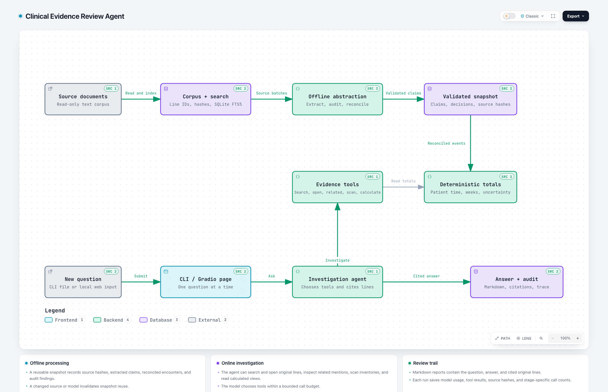

# Clinical Evidence Review Agent

This Python CLI creates a source-audited abstraction of text clinical records and answers related questions through a bounded, tool-using agent. It is a prototype for one review corpus at a time. Source records remain read-only; every run gets a new output directory.

## Architecture and reviewed answers

**[Download the interactive architecture diagram](architecture/clinical-evidence.html)** · [View its source specification](architecture/clinical-evidence.architecture.json) · [Browse all 15 reviewed question, answer, and evidence reports](validated-answers/README.md)

The diagram was generated and checked with [Archify](https://github.com/tt-a1i/archify). Open the downloaded standalone HTML in a browser to explore its components and source links.

[](architecture/clinical-evidence.html)

| Original question | Reviewed result | Full answer and evidence |
|---|---|---|
| Therapy encounters | 12 sessions across 11 days: 5 individual, 5 group, 2 family | [DEV-01](validated-answers/DEV-01.md) |
| Delivered therapy time | 585–595 minutes overall; weekly totals 140, 120, 180, and 145–155 | [DEV-02](validated-answers/DEV-02.md) |
| Weekly plan goal | Not met, not met, met, and undetermined across the four weeks | [DEV-03](validated-answers/DEV-03.md) |
| January 19 and 21 care | January 19: two contacts, 90 minutes; January 21: one contact, 45 minutes | [DEV-04](validated-answers/DEV-04.md) |
| Symptom course | Three distinct PHQ-9 scores of 18, 14, and 10; partial improvement with ongoing difficulty | [DEV-05](validated-answers/DEV-05.md) |

The [ten independent examples](validated-answers/README.md#independent-questions) cover authorization, copied records, no-shows, family support, future care, and time calculations. The answer key was held outside the repository and was not part of the searchable corpus.

## Setup

Python 3.11+ and `uv` are recommended:

```bash
uv sync
```

Set a key for a **general-purpose, programmatic model API** in the environment. For Z.AI's regular OpenAI-compatible API, use `ZAI_API_KEY`; for OpenAI, use `OPENAI_API_KEY`. The Anthropic adapter accepts `ANTHROPIC_API_KEY` or `ANTHROPIC_AUTH_TOKEN`. Keep credentials outside version control and run outputs. A local `.env` file is ignored by Git; load it with `uv run --env-file .env`. Both keys may be set at once: an explicit Z.AI base URL selects `ZAI_API_KEY`, while the default OpenAI endpoint selects `OPENAI_API_KEY`. The [Z.AI Coding Plan endpoint](https://docs.z.ai/devpack/quick-start) is documented for supported coding tools, while the [standard API endpoint](https://docs.z.ai/guides/overview/quick-start) is for programmatic model calls; use the latter for this application with an eligible API key.

For `glm-4.7`, the adapter disables thinking by default to keep extraction and tool responses within the output budget. Set `BB_GLM_THINKING=enabled` to test the reasoning variant. Z.AI documents this [per-turn thinking control](https://docs.z.ai/guides/capabilities/thinking-mode).

## Run

```bash
uv run --env-file .env bb-review \
  --documents documents \
  --questions questions.json \
  --provider openai \
  --model YOUR_MODEL \
  --base-url YOUR_API_BASE_URL \
  --start 2026-01-05 --end 2026-01-30
```

The questions file is a JSON array of strings or `{ "id": "...", "question": "..." }` objects. `--start` and `--end` define an inclusive review period; omit them to include all extracted dates. Results appear in a new `runs/<timestamp>-<random>/` directory:

- `abstraction.json`: source hashes, extracted claims, event reconciliation, unresolved items and audit findings.
- `calculation.json`: event ledger, bounded minutes and sessions, weekly totals and goal decisions.
- `answers.json`: answers, citations and citation audit results.
- `reports/question-001.md` and later numbered files: question, answer, exact cited source lines, and online model call count.
- `trace.jsonl`: extraction, reconciliation, model and tool calls with token usage.
- `run.json`: model, runtime, source manifest, stage-specific call counts and usage summary.

Markdown reports contain **Question**, **Answer**, and **Evidence** sections. The model generates the answer and inline citations. The Evidence section copies the cited original document lines locally, without another model call or additional model output tokens. The displayed call count includes only the online calls made to answer that question. Offline processing calls remain separately recorded in `run.json`.

The original inputs are `documents/` and `questions.json`.

For a new model, omit `--snapshot` to process the original documents. After a successful offline run, later questions with the same model and unchanged documents may reuse its `abstraction.json` through `--snapshot`; source hashes, model identity, and validation findings are checked before reuse. `--reuse-cache` is an explicit content-addressed stage option.

When `--reuse-cache` is explicitly selected, validated extraction and reconciliation batches are cached by model, prompt and input content under the chosen output root's `_stage_cache/`. Progress messages identify the active batch or question.

## Local question page

First let the new model process the original documents, with a separate output root. `--prepare-only` skips the five development answers so you can ask only the questions you want in the page. The command prints a unique run directory when finished:

```bash
uv run --env-file .env bb-review \
  --documents documents --prepare-only \
  --provider openai --model YOUR_MODEL \
  --base-url YOUR_API_BASE_URL \
  --output runs/new-model \
  --start 2026-01-05 --end 2026-01-30
```

Install the optional Gradio interface and point it to **that new run directory**:

```bash
uv sync --extra web
uv run --env-file .env --extra web bb-review-web \
  --run PATH_PRINTED_BY_BB_REVIEW \
  --provider openai --model YOUR_MODEL \
  --base-url YOUR_API_BASE_URL
```

Open `http://127.0.0.1:7860`, enter a new question, and click **Ask**. The page shows the answer with source references. **Download Markdown** provides the question, answer, cited original lines, and online model call count. The page checks the model, source hashes, calculation, and validation findings before using a saved offline result. It reuses document processing across questions. Each answer and its model trace are saved under ignored `runs/web/`. To generate the original five answers, run `bb-review` separately with `--questions questions.json` and `--snapshot PATH_TO_ABSTRACTION` after the offline run.

The page listens on the local computer at `127.0.0.1`. For another document set, pass its original source directory with `--documents` to both commands and use the run directory created from those documents.

## Method and checks

The source adapter assigns stable document IDs and line numbers and builds a SQLite FTS5 index. A model extracts source-specific event, plan, measurement and observation claims in batches. Source-line labels are normalized to integer anchors when unambiguous. Extraction, time-scope audit, and reconciliation validate complete model outputs and provide concrete feedback for bounded model repair. A source-coverage check revisits explicitly identified encounters. A selective time-scope audit distinguishes group/session time from patient-specific contact time. A reconciliation pass combines claims about the same encounter, retaining explicit corrections and conflicting intervals. The deterministic calculator unions actual patient-contact intervals, subtracts breaks, aggregates by day and Monday–Sunday week, and compares documented goals. The answer agent can search, open sources, inspect all claims for an event, page through complete inventories and request calculated views.

The code uses a narrow `ModelPort` (Adapter pattern), `Corpus` source/search port (Repository pattern), and a bounded tool runtime (Agent/Command pattern). The model and storage adapters can be replaced independently. Native `anthropic` and `openai` SDKs provide the wire protocols; Pydantic validates the data contracts. This small tool loop keeps the take-home project runnable without a LangGraph service dependency. LangGraph's `create_agent` is an optional replacement for the same tool protocol if a larger deployment needs middleware or durable execution.

The checks cover source addressing, interval union/subtraction, uncertainty bounds, goal comparison, model-stage repair, and report generation. Model-based evaluation uses the supplied questions and independent questions with a reusable offline snapshot.

## Debugging a run

Start with `run.json` to see source hashes, whether the offline snapshot was reused, runtime, token usage, and separate offline and online model-call counts. `abstraction.json` contains extracted claims, reconciled events, and audit findings; `calculation.json` contains the event ledger and weekly totals. For an answer, find its `question_id` entries in `trace.jsonl`: model turns include returned text, stop reason, requested tools, and usage; tool entries record arguments and results. Compare the final `answers.json` entry with its `reports/question-###.md` source excerpts. The Gradio page writes the same answer trace beside each downloaded Markdown report under ignored `runs/web/`.

These local trace and run files can contain source text, questions, and model responses. The `runs/` directory is excluded from Git.

Implementation assistance: OpenAI Codex generated and reviewed the code and architecture. Technical ideas and libraries are credited in [the implementation plan](cn/IMPLEMENTATION_PLAN.md).
