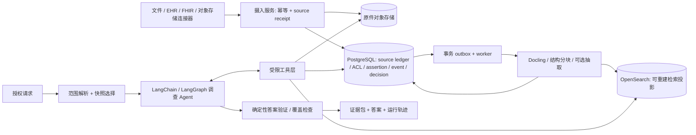

# BB 临床记录证据 Agent：最终架构与实施计划

**设计定稿：2026-09-29。状态：研究与实施规格；未写项目代码，也未宣称通过十万文档实测。**

## 0. 结论与适用范围

本方案面向用户要求的**企业系统原型**：几万至几十万份持续变化的异构记录、许多患者和租户、不同权限、上千种组合式新问题。当前 31 份记录及 `questions.json` 中的五题只是开发夹具。原题要求 2–5 小时内提交可运行项目，且只要求相关新题；本轮用户明确把目标提高到了企业规模，并明确要求**现在先完成调研与设计，不写代码**。两种范围必须在以后提交材料中分开陈述：架构目标可以是企业规模，能力声明必须由对应实测支持。[本地题目原文](/Users/huangziheng/Documents/BB-take-home/problem-statement/Problem%20Statement.md)、[开发题](/Users/huangziheng/Documents/BB-take-home/problem-statement/questions.json)。

**主线选择**：Python；PostgreSQL 保存不可变来源、证据、关系、权限与计算视图；对象存储保存原件；OpenSearch 保存可重建的全文/可选向量检索投影；Docling 处理复杂格式；LangChain `create_agent`（基于 LangGraph）提供真实的工具选择和多轮调查；确定性领域服务负责版本裁决、穷举、算术、权限和引用核验。OpenAI 与 Z.AI/GLM 通过同一个模型端口及两个适配器接入。LangSmith 用于合成数据评测；真实临床资料默认只进本地受控轨迹。

这不是“预设五题的流程”。Agent 可以把新问题拆成子问题、选择工具、阅读新证据、发现矛盾后改查另一类来源、按需抽取未预设谓词，并决定何时停止。固定的是权限、证据存储、计算和核验边界。对于任意自然语言问题，**不承诺必然得到完整确定答案**；系统必须区分“确认没有”“未找到”“没有检索全”和“有冲突”。

## 1. 设计驱动：当前资料揭示了哪些通用失败模式

| 当前夹具中的现象 | 要抽象出的通用规则；不得硬编码患者事实 |
| --- | --- |
| 1 月 19 日出勤记录后来只更正了离开时间；更晚收到的重传旧表仍有旧值 | **接收时间不是事实优先级**；更正按事件及字段生效，重传属于来源副本，不能新建一次接触或恢复旧字段。 |
| 远程会话发生断线及重连 | 接触身份与患者实际在场时间分开；同一接触可含多个在场区间，断线区间不计治疗分钟。 |
| 收费、预约、未签署草稿与最终出勤不同 | 来源记录类型与业务事实类型分开；收费存在不能独立证明服务实施。 |
| 家属参与的会谈有患者未在场时段 | “发生了一次会谈”“患者参加”“患者实际接受治疗分钟”是三个不同谓词。 |
| 量表后来被导入/复制 | 表单副本与独立测量分开；测量实例识别须看原始填写时间、答案和来源关系。 |
| 治疗计划规定周一至周日每周目标 | 规则有版本、有效期、时区、纳入类型、分钟定义；不能从问题文字臆造。 |

这些记录是**数据与回归例子**，不是对 Agent 的指令。绝不使用文件名、患者名、题号作为运行时业务分支。题目鼓励“准确、可审计的临床抽象”、来源冲突和计算追踪，因而下面的来源账本与证据决策是核心，而非普通向量问答。[题目](</Users/huangziheng/Documents/BB-take-home/problem-statement/Problem Statement.md>)。

## 2. 调研决策：成熟方案究竟复用到哪一层

“直接用”指**通过适配器调用已发布包/API**，不复制内部源码；“借鉴”指借其公开架构/算法，业务语义自行实现。任何替代方案必须通过第 12 节的同一组契约试验。

| 组件与一手来源 | 可直接用的边界 | 不能交给它的部分 / 最终判断 |
| --- | --- | --- |
| [Onyx 标准版](https://github.com/onyx-dot-app/onyx/blob/main/README.md)、[连接器接口](https://github.com/onyx-dot-app/onyx/blob/main/backend/onyx/connectors/interfaces.py)、[连接器说明](https://github.com/onyx-dot-app/onyx/blob/main/backend/onyx/connectors/README.md)、[聊天检索设计](https://github.com/onyx-dot-app/onyx/blob/main/backend/onyx/chat/README.md) | 它有企业连接器、权限搜索和 search→open→cite 机制；连接器的 `Load/Poll/Slim` 全量、增量、清点思想值得照用。若组织已有 Onyx **标准版**，可做独立 `SearchPort` 适配器试验；Lite 不提供文档索引。 | 不把 Onyx 的普通文档片段当“已裁决的临床事实”；运行整套服务会引入其队列/缓存/索引及数据模型。首选**借鉴摄入契约与工具体验**，不作为主架构前提。 |
| [R2R 代码库/API](https://github.com/SciPhi-AI/R2R)、[官方指南](https://github.com/SciPhi-AI/R2R/blob/main/docs/introduction/guides/what-is-r2r.md) | 现成导入、混合搜索、管理、agent API；适合作为第二个可替换检索后端候选。 | 必须测源版本、精确片段定位、权限撤销、漏检、更正和十万文档负载。其 agent 无权决定本方案的临床证据裁决；不同时运行两套 agent loop。 |
| [OpenSearch 混合检索](https://docs.opensearch.org/latest/vector-search/ai-search/hybrid-search/index/)、[DLS](https://docs.opensearch.org/latest/security/access-control/document-level-security/)、[索引别名](https://docs.opensearch.org/latest/im-plugin/index-alias/)、[Python bulk helper](https://github.com/opensearch-project/opensearch-py/blob/main/guides/bulk.md) | **主选直接用** `opensearch-py` 和 OpenSearch：BM25、精确过滤、可选向量/RRF、PIT/游标、批量写入、重建别名。 | 索引是投影，不保存唯一真相。bulk 会部分成功，必须逐条对账；DLS 管读取而非写入，且授权撤销要再由主库检查。RRF 不能召回两路均没找到的证据。 |
| [Qdrant 混合查询](https://qdrant.tech/documentation/search/hybrid-queries/)、[全文搜索](https://qdrant.tech/documentation/search/text-search/full-text-search/)、[多租户](https://qdrant.tech/documentation/tutorials/multiple-partitions/) 与 [pgvector 过滤说明](https://github.com/pgvector/pgvector/blob/master/README.md?plain=1) | 两者均是有根据的替代搜索引擎；若现有组织基础设施已采用它们，可以接入 `SearchPort`。 | 此题强调精确 ID、日期、标题、词法和权限过滤，先选 OpenSearch。pgvector 官方明确 ANN 过滤可在扫描后导致候选不足；须以精确查询为基准测 recall。Qdrant 的向量/稀疏检索同样要测窄患者和租户隔离。 |
| [Docling 转换器](https://docling-project.github.io/docling/reference/document_converter/)、[原生结构分块](https://github.com/docling-project/docling/blob/main/docs/concepts/chunking.md) | **直接用**解析 PDF/Office/HTML/表格及 `HybridChunker`；保留页、表、标题、定位，长表重复表头以供检索。纯文本与结构化 FHIR/CSV 用各自轻量解析器。 | 分块不代表事件或陈述；不能因为两段文本重叠就算两份证据。若解析的页/格位置不可靠，保留原件并标注定位质量。 |
| [Unstructured 分块源码](https://github.com/Unstructured-IO/unstructured/blob/main/unstructured/chunking/title.py) | 文件格式或 Docling 解析失败时可做备用 `ParserPort`；按标题、隔离表格是可复用能力。 | 不需要与 Docling 并行处理同一资料；双解析器增加版本与出处对齐难度。 |
| [LangExtract](https://github.com/google/langextract) 与 [Docling Graph](https://github.com/docling-project/docling-graph)、[其 provenance 机制](https://docling-project.github.io/docling-graph/fundamentals/graph-management/provenance/) | **选 LangExtract 做局部试验**：来源片段对齐的定向原子陈述抽取。Docling Graph 可对复杂多实体关系建立验证过的局部图，其来源账本设计值得借鉴。 | 原文中找到同样字串只能证明**文本位置**，不能证明其指的是患者、已发生、已签署或同一事件。Docling Graph 部分节点定位可能退化为页/文档级；不能把自动图谱全库生成当事实库。两者择优用于特定抽取任务，不都成为必装核心依赖。 |
| [LlamaIndex IngestionPipeline](https://developers.llamaindex.ai/python/framework-api-reference/ingestion/) | 转换缓存、upsert 和并发是可借鉴成熟做法。 | **主线暂不引入**：本方案需要自有不可变版本账本、索引水位和 Docling 位置映射；再套一层 ingestion 抽象收益有限。若缓存/并发实测成为瓶颈，可在 `TransformPort` 后局部接入，不能让 upsert 覆盖旧来源。 |
| [Graphiti](https://github.com/getzep/graphiti)、[GraphRAG 数据流](https://github.com/microsoft/graphrag/blob/main/docs/index/default_dataflow.md)、[LazyGraphRAG](https://www.microsoft.com/en-us/research/blog/lazygraphrag-setting-a-new-standard-for-quality-and-cost/) | 借鉴可追溯实体/关系和“按问题需要取图/延迟加工”。 | **不全库预建自由生成知识图谱**：更新和字段更正难传播，预处理成本高。先在 PostgreSQL 保存受控边与局部事件图；若跨病例全局主题查询证实收益，再增加图投影。 |
| [FHIR DocumentReference](https://hl7.org/fhir/R4/documentreference.html)、[FHIR Provenance](https://hl7.org/fhir/provenance.html)、[OMOP NOTE_NLP](https://ohdsi.github.io/CommonDataModel/cdm54.html) | 借鉴标准的文档引用、替换/追加、来源主体、NLP 片段；为未来 EHR 接口定义映射。 | 业务内部不必被单一标准资源形状限制；OMOP 的分析表也不代替精细的来源版本与字段级证据裁决。 |
| [LangChain `create_agent` / middleware](https://reference.langchain.com/python/langchain/agents/factory/create_agent)、[middleware 官方资料](https://github.com/langchain-ai/docs/blob/main/src/oss/langchain/middleware/built-in.mdx)、[LangGraph 持久化](https://docs.langchain.com/oss/python/langgraph/persistence) | **直接用**成熟工具调用循环、限额、重试、上下文整理、可恢复执行；LangGraph 的检查点只保存运行态。 | 不另手写 ReAct 循环，不把 checkpointer 当来源数据库。按临床证据语义增加业务工具和最终验证节点。 |
| [Pydantic AI Z.AI 模型适配](https://pydantic.dev/docs/ai/api/models/zai/) | Z.AI 的特殊历史 reasoning 处理是有价值的**对照实现**；若 LangChain 适配探针失败，可整体切换运行时。 | 不在 LangChain agent 里面再嵌 Pydantic AI agent。一次运行只存在一个工具循环。 |
| [Splink blocking](https://moj-analytical-services.github.io/splink/demos/tutorials/03_Blocking.html)、[datasketch MinHashLSH](https://github.com/ekzhu/datasketch) | 分别用于高量级事件链接候选、近似副本候选的**可选加速**。 | 仅产生候选，不自动删除来源、不自动确认同一事件。先用精确 ID 和小范围 blocking；只有配对规模或召回实测需要时才装。 |
| [medSpaCy](https://github.com/medspacy/medspacy) | 可为英文临床叙述提供否定、不确定、历史、他人经历等候选标记。 | 不能单独确证“患者目前有症状”或作最终评估；语言和写法漂移需独立测。 |

**为何不直接“拿来一个全套 RAG”**：Onyx/R2R 都提供可运行的通用检索/agent，但题目成败由字段级修订、事件身份、患者在场分钟、闭集统计和证据差异决定。公开功能说明没有证明它们已满足这些临床契约。现成引擎负责通用难题，薄领域层负责不可替代的语义；用同一组黑箱试验决定是否替换引擎。这是明确的待验证判断，而非对项目质量的否定。

## 3. 设计模式与整体拓扑

| 模式 | 在此处如何使用 | 需要守住的边界 |
| --- | --- | --- |
| **六边形架构 / Ports & Adapters** | 领域用例只依赖 `SourceRepository`、`BlobStore`、`SearchPort`、`ParserPort`、`ExtractorPort`、`ModelPort`、`TracePort` 协议。OpenSearch/Onyx/R2R、OpenAI/Z.AI 可替换。 | 适配器输出统一为本系统 `SourceRef / Hit / AssertionCandidate`；外部库类型不越过领域边界。 |
| **不可变账本 + CQRS 投影** | 原件、receipt、陈述及决策追加记录；OpenSearch、病例视图是可重建读模型。 | 不用索引 upsert 充当来源历史；不对事件更正做“最后写入胜出”。 |
| **Repository + Unit of Work + 事务 outbox** | 一个 PostgreSQL 事务写来源版本、权限、阶段状态和 outbox；worker 幂等消费后更新投影水位。[Debezium outbox 参考](https://debezium.io/documentation/reference/stable/transformations/outbox-event-router.html)。 | PostgreSQL 与 OpenSearch 无分布式事务；答案必须暴露快照/水位。小型部署可轮询 outbox，不必先引 Kafka。 |
| **策略模式** | `ResolutionPolicy` 按问题与证据类型决定字段优先级、覆盖规则和人工复核阈值；`SearchStrategy` 按任务选精确/词法/混合/穷举。 | 策略版本写入决策和答案；不允许一个全局“签署>未签署>最新时间”排序规则。 |
| **状态机** | 来源 `received→parsed→indexed→abstracted`，失败可重试；事件链接 `candidate→verified / rejected`；裁决 `proposed→accepted / disputed`。 | 状态迁移记录作者/规则/时间；未经验证候选不能悄悄进入确定性统计。 |
| **规格/受限查询对象** | Agent 提交结构化 `ScopeSpec`、`EvidenceQuery`、`AggregateSpec`，服务器编译成授权 SQL/搜索 DSL。 | 不能提交任意 SQL、索引名或自选 tenant ID；时间和日期语义显式。 |
| **防腐层** | FHIR、CSV、Onyx、R2R、Z.AI 输出先映射到本系统的稳定契约。 | 核心领域不随上游 API 形状变化。 |

总体选型是**单 Agent + 多个有权限的业务工具 + 若干确定性节点**。现阶段不加多 Agent 主管/专家层：它会增加交互和错误传播，而问题的并行子检索可以在同一 agent 的工具层完成。若将来长问题确需并行专家，每个专家仍只能经同一工具服务和同一快照访问证据，最后统一核验。[Anthropic 关于 agent/工作流边界](https://www.anthropic.com/engineering/building-effective-agents)、[LangChain agent 代码](https://github.com/langchain-ai/langchain/blob/master/libs/langchain_v1/langchain/agents/factory.py)。

## 4. 数据契约：来源、陈述、事件、决策分开

**4.1 最小实体**（下列是实施时的字段契约，不是已建表）：

| 实体 | 关键字段和不变量 |
| --- | --- |
| `SourceIdentity` | `tenant_id, source_system, external_document_id, patient/case_candidates`；跨系统同名不得合并。源身份与物理 blob 分开。 |
| `SourceReceipt` | 每次接收独立 `receipt_id, received_at, connector_cursor, content_hash, metadata_hash, access_policy_version`；即使重传完全相同 blob，也保留接收事实。 |
| `SourceVersion` | `source_version_id, source_id, authored_at, signed_at, valid_period, content_hash, status, predecessor/relates_to`。同字节不同签署/元数据仍可能是不同逻辑版本；旧版只追加状态关系，不覆盖。 |
| `Segment` | `segment_id = hash(source_version_id, parser_version, path, ordinal)`, `page, section, table, row, column, char_start/end, text_hash, location_quality`；可由定位回读原件。 |
| `Assertion` | `assertion_id, subject, experiencer, reporter, predicate_uri_or_text, raw_quote, normalized_value/unit, polarity, certainty, conditionality, event/valid_time, recorded_time, source_span, extractor_version, review_state`。原话与结构化解释都保留。 |
| `Relation` | `copy_of`, `amends(field_path)`, `same_event_candidate`, `same_event_verified`, `supports`, `contradicts`, `derived_from`, `measurement_copy_of` 等；有来源、方向、状态和生效时间。 |
| `EventCluster` | 稳定事件 ID、成员陈述/来源、服务身份、link 版本；事件合并可撤销并重算。一次接触可有多个会话连接或在场区间。 |
| `FieldDecision` | 针对 `event_id + field_path + policy_version` 记录候选、采用/拒绝来源、规则、冲突、`effective_at`、审查状态。只有此层的可审计结果可进入“已确定”计算视图。 |
| `ProjectionWatermark` / `AnswerRun` | `source_seq, index_generation, indexed_seq, extraction_version, policy_version, acl_epoch, snapshot_id`；答案还记查询、工具轨迹、公式、引用、模型/提示版本及覆盖状态。 |

**4.2 时间是多维度**。`service_time`（发生）、`authored_at`（撰写）、`signed_at`（签署）、`received_at`（进入系统）、`ingest_seq`（本系统看见）分别存。复核问题可以指定 `as_known_at`，重现当时结论；当前结论要包括后来更正。治疗计划另有目标生效区间。每个时点保存原时区和规范 UTC；“周一–周日”使用服务所在地日历而非 UTC 周。FHIR 的 [DocumentReference](https://hl7.org/fhir/R4/documentreference.html)区分文档索引元数据及临床上下文，提供了很好的交换映射，但内部字段仍以审计需要为准。

**4.3 三个不能混淆的动作**：

1. **物理/语义副本识别**：完全相同字节可复用 blob；不同 receipt/source/version 仍保留。近似副本用 `datasketch` 提候选，随后比对作者、签署、来源和文本。绝不因高相似度自动丢弃。[datasketch](https://github.com/ekzhu/datasketch)。
2. **事件身份链接**：先用上游 encounter/appointment ID；无 ID 时只在同租户同患者、兼容日期/服务/参与者的 block 内配对；再看证据语义。高置信可自动确认，灰区交复核；记录可拆分。只有候选量证明需要时才用 Splink 的多 blocking 规则概率连接。[Splink](https://moj-analytical-services.github.io/splink/demos/tutorials/03_Blocking.html)。
3. **字段级有效值裁决**：显式更正边只替代目标事件的目标字段；其他字段保留既有可用证据。证明服务是否发生需看服务记录、出勤、签署、取消等的具体冲突；收费或预约只证实各自事实。无法裁决时保存 `disputed` 并给可行区间。

例：原出勤记 10:00–11:30，更正将离开时间改为 11:15，后来重发原表。有效事件的开始仍 10:00、结束采用 11:15；原 11:30 和重发副本在审计链里仍可见。此例只用于测试字段级行为，不写进业务 if/else。

## 5. 摄入与预处理：十万份资料仍能付得起

**连接器接口**按 Onyx 成熟经验拆成 `initial_scan()`、`poll(cursor)`、`reconcile_ids_and_acl()`；实现文件夹、对象存储、FHIR/EHR export 三类起步。每条源记录有幂等键 `tenant + source_system + external_id + external_version/etag + metadata_hash`。若系统只给文件且无外部版本，内容/元数据哈希与接收序号共同建逻辑版本。连接器不得自行决定来源是否“临床真实”。[Onyx 接口源码](https://github.com/onyx-dot-app/onyx/blob/main/backend/onyx/connectors/interfaces.py)。

| 层 | 全库执行 | 选择性/异步执行 | 存储与失败语义 |
| --- | --- | --- | --- |
| T0 来源 | 授权/病例候选、原件、hash、receipt、版本、基本元数据，记录 outbox | 大文件/格式支持检查 | 保存原件即使解析失败；失败列入 coverage manifest。 |
| T1 结构 | DOCX/PDF/HTML 走 Docling；纯文本按行/节；FHIR/CSV 保持结构。生成父节与子片段、精确 locator、BM25 元数据索引 | OCR 按格式/质量触发；embedding 取决于检索评测结果 | parser 版本和源 hash 入缓存键。表格保留表头、行列和单位；不把同一表行重复计成两条来源。 |
| T2 高价值抽取 | 规则识别签署、取消、更正和显式 ID；产生待核验关系 | 与安全/计数/时间线有关的服务、在场区间、计划目标、量表、症状变化用 LangExtract 或任务化 LLM 定向抽取 | 缓存键包含源 hash、定位、任务 schema、提示、模型/参数、抽取版本；原输出和 span 全留存。校验失败标为未知。 |
| T3 查询时抽取 | 无预定义谓词也可由 agent 搜寻原文 | 对定位过的父节提取新谓词/关系；缓存并审查，不自动回填全局确定性视图 | 支持长期长尾新问题。 |

Docling 原生 `HierarchicalChunker/HybridChunker` 已按文档结构分块，适合拿来用；**检索片段大小不应固定到一切文档**。保留段落/表格单元最小锚点，索引时可拼入标题和邻近上下文，答案引用仍回到最小锚点。[Docling chunking](https://github.com/docling-project/docling/blob/main/docs/concepts/chunking.md)。

**成本控制**：没有必要对 100k 原件逐份做多轮 LLM。报告 `文档大小分布 × 结构片段数 × T2 触发比例 × 每片段 token × 重试率`，用实际负载衡量。上游格式迁移或 parser/embedding 升级只重建相关投影，不改不可变原件。`LangExtract` 的对齐仅证明文字存在；抽取 schema 需明确病人/他人、否定、推测、历史、计划 vs 已执行、时间及单位。[LangExtract 源码](https://github.com/google/langextract)、[medSpaCy Context](https://github.com/medspacy/medspacy)。

**一致性协议**：提交 receipt 与 outbox 后，worker 先解析再写索引，记录每个 projection 的最大连续 `source_seq`。OpenSearch `helpers.streaming_bulk`/`parallel_bulk` 要检查**每一项**成功而非只看请求状态；失败重试/死信并使水位停在未完成项。重建用新索引加别名切换；查询绑定 `index_generation + source_high_watermark`，如果后端落后则等待、补查主库或明确标注不完整。PIT 加 `search_after` 仅固定 OpenSearch 的分页视图，不能为 PostgreSQL 和 OpenSearch 提供分布式快照。[bulk helper](https://github.com/opensearch-project/opensearch-py/blob/main/guides/bulk.md)、[PIT](https://docs.opensearch.org/latest/search-plugins/searching-data/point-in-time/)、[别名](https://docs.opensearch.org/latest/im-plugin/index-alias/)。

## 6. 检索和“找全”：两种不同契约

检索首先由服务器决定授权 `tenant/patient/case/cohort`。Agent 只能建议时间、类型和关键词，不得扩大授权范围。OpenSearch 使用共享索引（按实际 shard 容量规划，不给每个患者建索引），精确 ID/date/status/ACL 为 `keyword`/date，叙述为 text，向量字段按评测结果启用。近似向量只承担发现候选，重要查询必须同时跑 BM25、元数据/ID 和事件邻域扩展。混合检索可用 RRF，但 RRF 只融合已召回候选。[OpenSearch hybrid](https://docs.opensearch.org/latest/vector-search/ai-search/hybrid-search/index/)。

| 操作 | 后端契约 | 可作出的覆盖声明 |
| --- | --- | --- |
| `search_evidence` | 返回排序候选、短摘要、原件版本/定位、命中字段、游标；重复源可折叠展示但不能被丢弃。 | **探索性**；`top-k` 不是全集。 |
| `open_source` | 验证权限后从原件或结构化片段读具体页/行/单元；展示来源状态及相邻上下文。 | 可核实该片段存在与上下文。 |
| `expand_related` | 以事件/陈述为中心沿更正、副本、支持、矛盾边扩展，返回所有可访问成员及未核验边数。 | 找到已知事件图中的相关资料；仍须注意尚未解析来源。 |
| `enumerate_scope` | 对 source ledger/受控事件视图做稳定分页或后端聚合，返回源/事件 ID、总数、未解析/未索引数与完结标识；不传全量正文给模型。 | 只在“该范围所有合资格来源已纳入且投影水位一致”时可对集合宣称完整。 |
| `aggregate_review` | 基于受控视图与规则版本做 count/sum/group/filter，并提供每个纳入/排除/争议 ID 的可下载审计表。 | 统计值可复算；争议给下/上界或无法确定。 |

Agent 对“某段记录提到什么”可以先探索检索；对“共有多少次/几分钟/是否每周达标”，必须调用穷举/聚合，不能把 top-k 的片段相加。对新题型，agent 组合 `select/filter/compare/temporal/aggregate/reconcile/explain` 操作；必要时回读未预抽取的原文。对跨病例总体问题，计算在数据库完成，模型只接收聚合与抽样可核验证据。普通 RAG 的多跳弱点已有 [MultiHop-RAG 原论文](https://arxiv.org/abs/2401.15391)研究；[Azure agentic retrieval](https://learn.microsoft.com/en-us/azure/search/agentic-retrieval-overview)的分解/合并模式可参考，但本系统还要做事件和修订关系扩展。

**Coverage manifest** 按请求保存：授权源总数、解析成功/失败数、已索引水位、相关来源类型检查结果、事件关系未确认数、引用权限、筛选条件和已读取的页/节。它能证明指定闭集统计的摄入完整性；不能数学证明任意开放问题已找到一切潜在相关叙述。回答要区分 `established`、`disputed`、`insufficient_source`、`incomplete_ingestion`、`out_of_scope`。

## 7. 真正的 Agent：运行态、工具契约、停止条件

`create_agent` 提供模型↔工具迭代。运行前生成 `InquiryState = {principal, immutable_scope, snapshot, question, hypotheses, outstanding_evidence, seen_refs, budget, coverage}`。模型可在每轮选择下一项动作，模型不直接持有数据库账号。业务工具只接收不含租户身份的结构化参数，权限由运行态注入。[LangChain 源码](https://github.com/langchain-ai/langchain/blob/master/libs/langchain_v1/langchain/agents/factory.py)、[工具设计经验](https://www.anthropic.com/engineering/writing-tools-for-agents)。

| Tool（动态暴露 4–6 个，全集如下） | 最小输入 | 结构化输出和错误 |
| --- | --- | --- |
| `resolve_scope` | 患者/病例线索、时间表达式 | 仅返回授权匹配，歧义候选、日历时区、snapshot；歧义不猜。 |
| `search_evidence` | query、精确过滤、模式 `lexical/hybrid`、cursor | `hit_id, source_version_id, locator, snippet, why_matched, next_cursor, index_watermark`；明确 `ranked_not_exhaustive=true`。 |
| `open_source` | `source_version_id + locator` | 原文、上下文、状态、作者/签署/接收时间、引用令牌；权限重查。 |
| `expand_related` | `event_id/assertion_id`, edge set | 所有已知支持/矛盾/更正/副本、未核验边与分页。 |
| `enumerate_scope` | `ScopeSpec, entity, filter, cursor` | 有限页 ID、总数、未解析数、完结标识、snapshot；只能选择白名单字段。 |
| `query_abstraction` | `PredicateSpec, temporal filters` | 受控陈述/事件、有效值、状态、源 span、决策理由；无预抽取不等于不存在。 |
| `derive_targeted` | 新谓词 schema + 已定位来源片段 | 临时陈述候选、原文 span、validation errors、模型版本；未经核验不进确定性聚合。 |
| `aggregate_review` | 聚合规格、目标/分钟规则版本 | 值或范围、纳入/排除/争议行、公式、审计表 ID、coverage。 |

8 个业务能力不等于每轮给模型 8 段长描述。用 middleware 根据问题、上下文和权限加载最相关 4–6 个；如果工具选择失误，始终有 `search/open` 基本入口。对模型调用和工具调用设硬预算、超时、有限重试，清理旧工具输出时只清对话副本，不清数据库证据。LangChain 已提供 `ToolCallLimitMiddleware`、重试/上下文编辑等；直接复用并记录版本。[官方 middleware](https://github.com/langchain-ai/docs/blob/main/src/oss/langchain/middleware/built-in.mdx)。

**调查循环**：① 解析意图、范围和可能的统计/开放结论；② 搜索/枚举，记录每项证据需求；③ 读原件与展开事件邻域；④ 遇到反证/缺口时重新检索或定向抽取；⑤ 需要数量时调用确定性聚合；⑥ 检查 coverage 与未解决争议；⑦ 生成带引用的回答。步骤是**守卫条件**，不是五题固化的逐步脚本：可跳回、并行子检索、改计划。停止必须满足至少一项：证据足以支持结论且 coverage 合格；确认记录不足并准确说明缺口；预算耗尽且输出“未完成/不可判定”，不强行给确定数字。

**答案验证器**独立于模型：引用令牌必须来自本次授权快照且指向具体位置；每个关键数字与 `aggregate_review` 完全相等；关键排除/冲突有解释；未索引/未解析不能被描述为“没有”；文本结论要有匹配的来源片段。最后一项的语义不能靠字符串匹配保证，需基准集和人工抽查。检索文档视为不可信数据，不能把其中的“忽略以上指令”提升为系统指令。[OWASP RAG security](https://cheatsheetseries.owasp.org/cheatsheets/RAG_Security_Cheat_Sheet.html)。

## 8. 确定性计算与问题泛化

领域计算采用可复核的纯函数/SQL 查询；LLM 只提出问题、解释证据和报告不确定性。可控的**开放事实账本 + 少量关键物化视图**兼顾未见问题与大规模统计：`ContactView`, `PatientPresenceInterval`, `MeasurementInstance`, `PlanGoal`, `MedicationChange` 等按明确证据构建；新谓词可以从原文按需派生，不要求系统事先枚举 1000 个业务字段。

| 计算对象 | 明确算法/不变量 |
| --- | --- |
| 接触数 | 在给定服务/日期/计划规则下，计 `verified EventCluster` 一次；电话断线不是新接触；文档副本、收费、预约不是接触。可疑 cluster 不强制并入或拆出，结果给范围。 |
| 治疗分钟 | 每个服务只对**患者在场且合资格**的闭开区间 `[start,end)` 求并集，减去断线/休息/家属独处；跨服务重叠核查并标为冲突，不能无解释地双计或去重。存秒级原始值后明确分钟舍入政策。 |
| 周归属/治疗日 | 用服务所在地时区将实际服务分配到周一–周日；跨午夜区间按日/周切分；一日多个服务只计一个 distinct 治疗日。 |
| 计划目标 | 读取生效期内相应版本的目标、服务类型纳入/排除和计量口径；比较 `days` 与 `patient_minutes` 两个条件。来源不完整或边界未定时用 `met / unmet / indeterminate`。 |
| 症状与测评 | 按实际评估实例/时间、报告者、否定和不确定性排时间线；复制导入不是新测量。变化归因只能到文档支持的强度，不能从评分变化推断未记录的治疗因果。 |

“更正后分钟”是由**字段决策**导出的计算，不是抽取时直接写死一个最终数。计算输入明细（事件、区间、规则、来源）与输出哈希一起保存在 `AnswerRun`，让运行可重现。对小范围病例可精确枚举；对 100k 级全体队列使用数据库聚合与分页审计表。PostgreSQL 的 [range/multirange 类型](https://www.postgresql.org/docs/current/rangetypes.html)可用于区间并集，具体版本支持与执行计划在实施时验证。

## 9. 模型接口：OpenAI 与 GLM 一层调用

**不写一个再包一个的 LLM 框架**。领域层使用 `ModelPort`：`invoke(task, messages, tool_schemas, output_schema, budget, trace_ctx) -> ModelResult`。实现 `OpenAIModelAdapter` 和 `ZAIModelAdapter`；`ModelFactory` 依据部署配置选择。`ModelResult` 统一 `tool_calls / structured_output / usage / finish_reason / refusal / raw_response_ref / provider_metadata`。`create_agent` 获得适配后的 LangChain `BaseChatModel`；抽取器也经同一 `ModelPort`，但不是第二套 agent。若包的 `ChatOpenAI` 直接满足 Z.AI 探针，适配器只做配置与响应正规化；否则薄封装 provider wire format。禁止在各业务模块到处直接 `OpenAI(...)`。

**能力矩阵是实测值，不凭“OpenAI 兼容”推断**：同一探针测多次工具调用、严格 JSON schema、普通 JSON、reasoning 内容续传、长上下文/截断、超时/重试、usage、取消及限流。OpenAI 官方的 strict function schema 要求对象 `additionalProperties=false` 且属性为 required；Z.AI 官方结构输出示例主要展示 `json_object`，还需本地 Pydantic 校验/重试，不能把两者宣称等价。[OpenAI 官方 function calling](https://developers.openai.com/api/docs/guides/function-calling)、[Structured Outputs](https://developers.openai.com/api/docs/guides/structured-outputs)、[Z.AI 官方结构输出](https://docs.z.ai/guides/capabilities/struct-output)、[Pydantic AI 的 Z.AI 适配参考](https://pydantic.dev/docs/ai/api/models/zai/)。

先测试用户已有的 `gpt-5-mini / gpt-5-nano / glm-4.7-flash / glm-4.5-flash / glm-4.5-air / glm-4.7-flashx` 中**实际可用**者。任务路由按实测：廉价模型用于局部抽取/检索改写；冲突裁决和开放问题给质量更好的已授权模型；确定性计算不调模型。记录 provider、模型名称、API 协议（例如 OpenAI Responses 与 Z.AI Chat Completions）、参数、提示哈希和用量。若 LangChain 的 Z.AI 接入在工具/历史 reasoning 上失败，再用 Pydantic AI 自带 Z.AI provider 做**整个 agent 运行时**对照，不把两者嵌套。[Pydantic AI Z.AI](https://pydantic.dev/docs/ai/models/zai/)。

## 10. 权限、安全、可观测性

租户与病例授权先由服务器签发不可伪造的 `AuthorizedScope`。PostgreSQL 作为主权限源，启用 RLS 并测试 owner/`BYPASSRLS` 例外；agent 工具只拿最小权限只读连接。OpenSearch 索引中的 `tenant_id, case_id, acl_groups, acl_epoch` 用精确 keyword 预过滤；返回 hit 后，`open/expand/aggregate/citation` 在 PostgreSQL **再次**核验当前权限，使异步索引落后的撤权立即生效。所有子片段继承父原件权限；禁止跨租户 relation，缓存键包含授权范围/ACL epoch。OpenSearch DLS 可以再加一层读取限制，但不能替代写入控制或主库复查。[PostgreSQL RLS](https://www.postgresql.org/docs/current/ddl-rowsecurity.html)、[OpenSearch DLS](https://docs.opensearch.org/latest/security/access-control/document-level-security/)、[Azure 逐 chunk ACL](https://learn.microsoft.com/en-us/azure/search/search-indexer-sharepoint-access-control-lists)。

工具不提供 shell、网页任意浏览、任意 SQL 或外部写入。原件中出现的指令只作为被引用的文本。审计记录每次授权决策、来源打开、索引版本、规则版本、模型调用 ID 和答案发布。Trace 默认只记录 ID、耗时、token、状态和脱敏错误；真实病例的原文/模型提示/工具输出是否可进 LangSmith 或第三方 provider，要由部署数据协议明确决定。合成夹具可直接用于 LangSmith 离线评测；受保护数据优先用本地 OpenTelemetry/日志。OpenTelemetry 的 GenAI 属性可能含输入输出文本，应默认关闭这类内容。[OWASP prompt injection](https://cheatsheetseries.owasp.org/cheatsheets/LLM_Prompt_Injection_Prevention_Cheat_Sheet.html)、[OpenTelemetry GenAI 语义属性](https://opentelemetry.io/docs/specs/semconv/registry/attributes/gen-ai/)。

## 11. 候选包与源码借鉴清单（实施者可直接查）

| 模块/拟用包 | 来源与可借鉴入口 | 采用方式 |
| --- | --- | --- |
| Python 交易/迁移：`SQLAlchemy Core`, `psycopg`, `alembic`, `pydantic` | [SQLAlchemy 事务](https://docs.sqlalchemy.org/en/20/core/connections.html)、[Alembic](https://alembic.sqlalchemy.org/en/latest/)、[Pydantic](https://docs.pydantic.dev/latest/) | SQLAlchemy Core + PostgreSQL 专有 SQL 实现账本/查询；Alembic 迁移；Pydantic 作为边界契约。避免把每个 evidence edge 强塞 ORM 对象图。 |
| 对象存储：S3 兼容适配器 | [MinIO Python SDK](https://github.com/minio/minio-py)、[Amazon S3 versioning](https://docs.aws.amazon.com/AmazonS3/latest/userguide/Versioning.html) | `BlobStore` 端口；本地开发也走可替换适配器。不可变 hash 与 receipt 在数据库，存储对象版本是附加保护。 |
| 检索：`opensearch-py` | [Python client](https://github.com/opensearch-project/opensearch-py)、[bulk helper 指南](https://github.com/opensearch-project/opensearch-py/blob/main/guides/bulk.md)、[hybrid](https://docs.opensearch.org/latest/vector-search/ai-search/hybrid-search/index/) | 直接使用，不复制搜索算法；索引 schema、事件邻域扩展和覆盖契约属于本系统。 |
| 文档：`docling` | [转换 API](https://docling-project.github.io/docling/reference/document_converter/)、[HybridChunker](https://github.com/docling-project/docling/blob/main/docs/concepts/chunking.md) | 直接使用并固定版本；`ParserPort` 规范化页/表/行 locator。 |
| 定向抽取：`langextract` | [Google 源码/示例](https://github.com/google/langextract) | 局部候选，先在关键字段试验；不自动判定语义真值。 |
| Agent：`langchain`, `langgraph`, `langchain-openai` | [`create_agent` 源码](https://github.com/langchain-ai/langchain/blob/master/libs/langchain_v1/langchain/agents/factory.py)、[middleware](https://github.com/langchain-ai/docs/blob/main/src/oss/langchain/middleware/built-in.mdx)、[checkpoints](https://docs.langchain.com/oss/python/langgraph/persistence) | 用现成 loop、工具限制与检查点；自定义受控工具和验证节点。 |
| Provider：`openai`、可选 `zai-sdk` | [OpenAI Python SDK](https://github.com/openai/openai-python)、[Z.AI Python SDK](https://github.com/zai-org/z-ai-sdk-python)、[Z.AI OpenAI 兼容/能力文档目录](https://docs.z.ai/llms.txt) | `ModelPort` 两个适配器；一处处理差异，不在领域里散落 provider if。 |
| 评测：`langsmith`、OpenTelemetry、Synthea | [LangSmith 评测类型](https://docs.langchain.com/langsmith/evaluation-types)、[Synthea README](https://github.com/synthetichealth/synthea/blob/master/README.md) | 真实来源基准 + 合成负载 + 长尾题；真值与统计核验自建。Synthea 提供格式/容量，不提供本题冲突真值。 |
| 可选候选：`datasketch`, `splink`, `medspacy`, `docling_graph` | [datasketch](https://github.com/ekzhu/datasketch)、[Splink](https://github.com/moj-analytical-services/splink)、[medSpaCy](https://github.com/medspacy/medspacy)、[Docling Graph](https://github.com/docling-project/docling-graph) | 只有针对明确瓶颈/质量收益通过 A/B 探针才进入正式锁文件。 |

**代码复用原则**：优先依赖维护中的公开包与稳定 API；任何确需借鉴内部实现的片段先核对许可、版本和归属，注明源文件与 commit；主项目保持原始版权/许可证要求。上述来源是拟采用/拟借鉴清单，**不是已经复制或实现**。锁文件固定包版本、解析模型/embedding 版本和具体提交；升级需回放语义与性能基准。

## 12. 可证伪的质量与规模验收

**基准数据分四层**：A 原 31 份/五题，人工逐条建立事件、分钟、目标、症状/评估真值；B 不同患者的独立叙述、表、扫描/缺页、其他语言/格式、权限变化；C Synthea 产生的 FHIR/C-CDA/CSV 等合成患者（需显式开启所需导出），再加入**独立编写**的更正/副本/取消/冲突/提示注入；D 10k→100k 来源规模，包含大病例、多个租户、频繁更新。只复制 31 份无法证明语义泛化。[Synthea 官方 README](https://github.com/synthetichealth/synthea/blob/master/README.md)。

**题型覆盖**以组合能力衡量：单源、跨源、多跳、时间线、数量/范围、计划版本、否定/条件、来源更正、开放未知谓词、跨患者授权队列。构建 1000 个**不同操作组合/证据模式**的保留题，题目及真值由独立生成/人工抽查，不允许把同一句换词算新类型。再做 metamorphic 试验：插入无关文档、重排接收顺序、重复旧表、只改一个字段、撤权、把一个事件拆成多份描述；预期答案/引用的变化按规则定义。测试不仅比较最终文字，还比较来源召回、事件链接、工具轨迹和计算账目。[LangSmith 评测分类](https://docs.langchain.com/langsmith/evaluation-types)、[Anthropic agent evals](https://www.anthropic.com/engineering/demystifying-evals-for-ai-agents)。

| Gate | 至少要交出的证据；通过标准在实测前登记 |
| --- | --- |
| G1 原件/版本 | 100k 份摄入后 receipt、版本、blob、outbox、索引 ID 数逐项对账；失败可重放；更正/副本不丢历史。 |
| G2 检索 | 分开报告 lexical/hybrid/事件扩展的 `required source recall@k`、精确 ID 命中、窄患者过滤召回；标注支持和反证。与候选全库/精确查询对照，不只看答案。 |
| G3 链接/裁决 | 事件同一性 precision/recall、错误合并数、字段级更正准确率、旧副本回流失败数；灰区必须可见。 |
| G4 算数与引用 | 金标准集合上的计数、分钟、周界和目标判定**完全复算一致**；零伪造来源定位；每个排除/争议可回溯。 |
| G5 权限 | 跨租户搜索/open/expand/aggregate/缓存/引用及撤权竞态全部做拒绝测试；泄漏次数必须为零。 |
| G6 泛化 | 1000 组合题分层报告正确/部分/弃答/错误、覆盖状态准确率；未知谓词必须能触发原文调查。 |
| G7 规模/代价 | 指明硬件、文档/片段大小分布、并发、解析和模型版本；报告 docs/s、索引滞后 P95、查询 P50/P95/P99、错误与成本。对普通病例、大病例和跨病例分析分别统计；以项目 SLA 决定绝对延迟门槛，不能凭空声称已达标。 |
| G8 安全/鲁棒性 | 原件中的提示注入不能执行工具越权、改变系统规则或让答案引用虚构来源；解析失败、部分索引、模型故障须显式降级/弃答。 |

**当前状态**：这些是未来实施的 release gate，尚无任何 100k 压测或千题质量实测结果。若五题都正确而 G1/G6 未跑，不能宣称企业能力；若负载通过而 G3/G4 失败，也不能宣称临床抽象准确。

## 13. Implementation plan：按依赖顺序落地

本节定义未来代码阶段的工作包、交付物与退出标准。本轮不执行。

| 阶段 | 要实现与直接复用的内容 | 产物 / 退出标准 |
| --- | --- | --- |
| **P0 真值与契约冻结** | 人工阅读现有资料，写独立事件/字段/区间/目标标注；起草 `SourceRef, SearchHit, AssertionCandidate, EventDecision, CoverageReport, AnswerRun` Pydantic schema；定义授权、时区和计量规则。 | 五题的审计真值、至少一批隐藏题、验收 fixture；任何输出能回指原件定位。 |
| **P1 接入探针（决策门）** | 同一小型语料在 OpenSearch、Onyx 标准版、R2R 上测：来源版本、片段精确定位、upsert 后旧版保留、权限撤销、事件邻域扩展所需 API、10k/100k 扩容路径。再对 OpenAI/GLM 测工具和结构化能力。 | ADR 写明主选/淘汰及实测；若 Onyx/R2R 真能满足 `SearchPort`，优先直接接入，避免重复造通用搜索。模型运行时只选一个。 |
| **P2 来源账本与摄入** | PostgreSQL 迁移、对象存储、文件/FHIR 连接器、receipt/version/outbox、幂等与 ACL、失败队列；Docling/文本/表解析并建立 source locator。 | 原件不可变；重复/更正/重传都可追溯；解析失败可见；权限撤销立刻生效。 |
| **P3 检索投影与覆盖** | `opensearch-py` 批量建索引、精确过滤、BM25；按检索评测决定 embedding/hybrid；PIT、别名、水位；实现 `search/open/enumerate/expand`。 | 一处能搜、打开、完整遍历来源；top-k 与穷举契约不同；索引落后显式报告。 |
| **P4 证据语义与计算** | 定向抽取、assertion/edge/event/field decision；事件链接、字段更正策略、患者在场区间与周目标纯函数；人工审核接口可先是 CLI/JSON 审核队列。 | 当前对抗案例逐条通过；统计输入清单、排除、冲突及公式可复算。 |
| **P5 Agent 与模型适配** | LangChain `create_agent`、受限工具注册、计划/反证/覆盖循环、预算 middleware；OpenAI/Z.AI 适配器；答案验证与证据包。 | 五题及新的开放题能动态用工具；替换模型不改领域代码；模型无法绕开权限或确定性计算。 |
| **P6 泛化评测与十万压测** | Synthea+独立叙述/冲突发生器，1000 操作组合题，元变换测试；10k→100k 摄入/查询/权限/更新测试。 | G1–G8 报告，包含硬件、成本、错误案例和未达到的门槛；根据失败回退调整组件/索引/抽取策略。 |
| **P7 提交和复现实验** | CLI/API、运行文档、锁文件、示例数据、五题答案和审计账本、日志、模型/成本说明、限制与后续调查。 | 评审者能从答案→决策→原件定位逐级回溯，并用新增文档/问题复跑。 |

推荐模块边界（未来目录名，仅供实施）：`domain/{source,evidence,event,policy,measurement,calculation}`；`ports/{blob,search,parser,extractor,model,trace}`；`adapters/{postgres,opensearch,docling,openai,zai,connectors}`；`application/{ingest,review,answer,coverage}`；`agent/{tools,runner,verification}`；`evaluation/{fixtures,metrics,load}`。领域层无 LangChain、OpenSearch 或 provider import。跨模块只传版本化 DTO 与受控查询规格。这比把所有东西放在一个 `agent.py` 或“万能 Provider”里更易替换和测量。

## 14. 最后一道设计审查：还有哪些不能假装解决了

1. **泛化上限**：可组合工具 + 原文回读能覆盖许多未知谓词，但不能保证任意 1000 种问题都有可判定答案。必须靠 G6 的新分布测试和弃答质量报告；新增业务规则若涉及新的计量概念，仍需版本化 policy。
2. **事件身份的灰区**：相似时间/内容不足以总是判定同一次服务。灰区保持两种可能及数量区间，或由人工复核；不自动强并。
3. **源缺失与否定结论**：没有检索到某事，不等于未发生。只有来源清单覆盖的受控闭集可以说“记录中无”；否则说明查询范围和欠缺来源。
4. **抽取成本与稳定性**：面向 100k 文档，昂贵的 LLM 只跑高价值或查询需要的片段；如果评测显示长尾检索召回低，再增加语义索引/抽取覆盖，按成本收益决定。
5. **权限与模型出境**：具体部署的存储、外部模型、轨迹采集须符合数据协议；本设计默认本地受控日志和最小必要上下文，不用供应商“默认安全”代替组织审核。
6. **工程规模与题目限时**：完整企业系统及 100k+1000 问题验收显然超过原题 2–5 小时。实施时应先交端到端可运行且审计正确的垂直切片，再按 P6 实证规模能力；对外陈述严格区分已跑的能力、架构准备和待测假设。

**最终评判**：这套设计让 Agent 承担真正需要开放推理的调查与探索；让成熟包承担解析、搜索、运行时和观测；把来源真相、时间/版本/权限、字段级裁决与数量计算留在可测试、可审计的领域层。实现前最重要的决策门是 P1 黑箱复用探针和 P0 的独立真值：若某个整套成熟服务真能满足同样契约，就接入它；否则按上述组件边界实现，不牺牲证据正确性。

## 15. 检索参数与故障语义的最后补充

**分级检索的具体顺序**：先做授权与精确元数据过滤；对 ID、日期、名称、服务类型用 BM25/keyword；对语义改写和陌生谓词可增加 dense 候选；合并候选后，**只在小候选集上**试 cross-encoder 重排；再打开父节和事件邻域寻找支持及反证。`RRF` 适合不同分数尺度的起点，但 OpenSearch 官方也说明其排序分数不能跨查询比较，且分数融合的效果要用本语料 relevance judgments 决定。[OpenSearch RRF 说明](https://docs.opensearch.org/latest/vector-search/ai-search/hybrid-search/rrf/)、[OpenSearch rerank processor](https://docs.opensearch.org/latest/search-plugins/search-pipelines/rerank-processor/)、[Sentence Transformers 的 retrieve→rerank 方案](https://sbert.net/examples/sentence_transformer/applications/retrieve_rerank/README.html)。

Embedding 的首轮候选可用 [FlagEmbedding 的 BGE-M3](https://github.com/FlagOpen/FlagEmbedding/blob/master/docs/source/bge/bge_m3.rst)及适合英文临床文本的其他可部署模型做离线对照；BGE-M3 提供 dense/sparse/multi-vector 能力，但模型大小、索引容量、语域适配和租户过滤成本均需测。它**不是默认全库必选依赖**。用同一批 gold queries 比较 BM25、BM25+dense、再加 reranker 的 required-source recall、NDCG、响应时间、索引占用和费用；只有增益覆盖代价时才启用。任何 reranker 只能重排已召回候选，不能修复候选漏检；统计题仍走 `enumerate_scope`。

**水位与坏文档**：不能让一个永久损坏的 PDF 将全库最新水位永久卡死。每个 source version 记录 `indexed / parser_failed / extraction_pending / acl_changed`；全局只显示已连续处理水位，另保存带 ID 的 exception set，查询按范围计算“相关来源中尚未可搜索/可抽象的数量”。若某病例与坏文档无交集，可继续回答该病例的闭集问题；若相交，则从对象存储/主库补读或把统计结论降级为不完整。索引 worker 的部分成功需逐条登记，重试不重复创建来源。权限撤销与这个例外机制独立，必须同步在主库生效。这个设计的正确性由 G1、G5 和 G8 的故障注入共同证明。

**部署边界**：应用代码先做一个按上述模块分层的 Python modular monolith；摄入 worker 与查询/API 可作为同一代码库的独立进程扩容，外部只需 PostgreSQL、OpenSearch 和 S3 兼容对象存储。outbox 先由数据库 worker 消费；只有队列吞吐、回放或多系统订阅的实测要求成立时才引入 Kafka/Debezium。按实测 `文档数 × 每文档片段分布 × 字段/向量字节数 × 副本数` 估算索引容量，再决定 shard 与 worker 数，不把 100k 文档本身当作固定容量值。CLI 和将来的 HTTP API 调用同一 application use case，避免出现两套证据规则。
