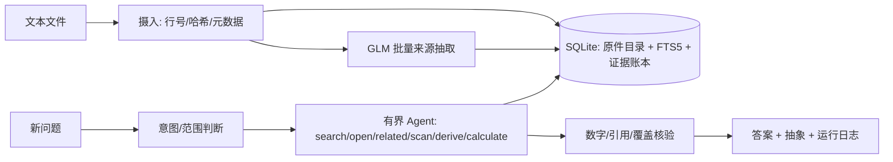

# BB 临床记录 Agent：可实现的精简架构与计划

状态：实施规格。完整调研保存在同目录的 `ARCHITECTURE-full-research.md`。本版按 [Problem Statement](</Users/huangziheng/Documents/BB-take-home/problem-statement/Problem Statement.md>) 的交付范围做减法：须能处理当前资料、相关新增文档与未见问题，产出可审计抽象、答案和日志；不把十万文档压测作为这次代码的前置条件。

## 1. 核心保证

1. **来源可回溯**：原件只读；每条抽取结果含文档 ID、行号、逐字证据。新版本、重传和更正都保留，不用“最新文件覆盖旧文件”。
2. **事件只计一次**：文档提及、预约、收费、草稿、实际服务是不同事实。同一 encounter 的多位作者或多段视频连接仍是一个接触；不确定归并要显式暴露。
3. **时间与数量由代码计算**：合资格、患者实际在场的时间区间求并集并扣除休息/断线；星期边界和治疗目标读取记录与规则版本。模型只抽取有出处的候选并解释结果。
4. **新问题可调查原文**：预抽取只覆盖常用临床事件、目标、测量、症状陈述；遇到新谓词，Agent 可搜索并打开任何授权来源、追加临时证据。未预抽取不等于不存在。
5. **区分确定、冲突和缺失**：结论应有纳入、排除和相反来源；来源不完整或仍有争议时不强给确定数字。

上述原则由题目中关于“准确、可审计、冲突、更正、相关未见问题”的要求驱动，不以五题或当前患者姓名写分支。

## 2. 最小可运行系统

**代码形态**：一个 Python CLI；内部按 `domain / ports / adapters / application / agent` 分层。`SourceStore`, `SearchPort`, `ModelPort` 是窄接口。首个适配器用 SQLite FTS5 和本地只读文件；以后可换 PostgreSQL + OpenSearch，而事件、证据、工具和答案协议不变。这保留企业扩展的设计模式痕迹，但不为作业部署三个服务。[OpenSearch 查询能力](https://docs.opensearch.org/latest/vector-search/ai-search/hybrid-search/index/)只作为扩展目标，**此轮可不实现**。

### 存储对象

| 对象 | 必须保留的内容 |
| --- | --- |
| `Source` | 文档 ID、文件名、SHA-256、完整文本、每行号、来源日期/状态；相同内容的不同收件仍有独立来源条目。 |
| `EvidenceAtom` | 原文引句与行号、主体/报告者、谓词和值、否定/计划/已发生等状态、发生时间、抽取置信和模型版本。开放谓词，避免固定五题字段表。 |
| `EventMention` | 某来源对一次接触的描述：encounter/appointment ID、类型、服务日期、预约/实际状态、患者在场区间、休息/断线、是否仅家属/行政。它是**来源陈述**，不是最终事件。 |
| `EventDecision` | 聚合同一事件的 mentions；每个有争议字段的采用值、支持/反对来源、裁决理由及状态。允许修正离开时间而保留未受影响的开始时间。 |
| `PlanGoal`、`MeasureInstance` | 计划目标及生效期；量表原始 form ID/完成时间/分数。导入副本映射到原实例。 |
| `AnswerRun` | 问题、快照源哈希、调用轨迹、纳入/排除清单、公式、引用、最终答案、model/usage。 |

### 摄入与抽取

所有文本文件先按行入库并建 FTS5，**不依赖模型**即可 `search/open`。然后以固定 token 上限打包多个文件做来源抽取；每段输入带不可伪造的 `doc_id:Lx-Ly` 标签。抽取目标是证据候选而非直接答案。引用必须与原文逐字及行号校验，失败候选进入 `unverified`，不可用于确定性统计。只在源 hash/抽取版本变化时重跑。当前 31 份文本很小，可以少量批次；以后可按病例/时间/文档组分批，而不把全库放进窗口。[Docling 的结构分块](https://github.com/docling-project/docling/blob/main/docs/concepts/chunking.md)为将来 PDF/DOCX 提供现成 `ParserPort` 实现，**这次文本夹具不必安装**。

一次轻量 reconcile 将 mentions 按明确 ID、患者、日期和服务类型聚集；模型只判断模糊的同一性与冲突，且保留所有原始 mention。不能“后收到者获胜”。字段级更正和副本关系来自证据内容。算法先采用上游 encounter/appointment ID；没有 ID 才在受限范围内生成候选，未判定则留区间或人工复核。不要对每道题重新抽取整个病例。

### Agent 与工具

Agent 是**有界的调查循环**，不是每题一条预写流程。运行时可根据问题与已发现的缺口，选择 `search(query, filters)`、`open(source, lines)`、`related(event)`、`scan(scope, predicate)`、`derive(source, question)`、`calculate(spec)`。`search` 返回相关候选，明确不能当全集；`scan` 分页枚举全部符合范围的来源/事件；`calculate` 只读已核实的事件视图，返回纳入/排除/争议和公式。`derive` 仅用于未覆盖的新谓词，并验证新证据锚点。

常见数量题可先走确定性视图和计算器，必要时 Agent 再调查冲突；开放题才多轮调用模型。限制每题工具与模型调用数，并把每次调用写日志。这个 fast path + Agent fallback 的目标是减少调用而不牺牲可审计性。可直接使用 [LangChain/LangGraph `create_agent`](https://reference.langchain.com/python/langchain/agents/factory/create_agent) 及其 [tool-call-limit middleware](https://github.com/langchain-ai/docs/blob/main/src/oss/langchain/middleware/built-in.mdx)；若兼容端点的工具调用不稳定，保留 `AgentRuntime` 接口，由薄实现承接同一工具协议，不能同时套两层 agent。

### 验证

计算器根据 `EventDecision` 求实际患者分钟：多个连接区间计一次接触、按区间并集求分钟；减去非治疗休息、家属独处；同一天只计一个治疗日；按服务地周一至周日拆分。计划目标从 `PlanGoal` 读，不写死“3 天/150 分钟”。答案验证器核对引用源与行、关键数字与计算器、冲突和缺源说明。不能仅用 LLM 自评。计数题必须 `scan` 完相关范围，不能 sum top-k。

## 3. 本轮明确 optional 的内容

| 延后项 | 触发条件；为何现在不用 |
| --- | --- |
| PostgreSQL、OpenSearch、对象存储、outbox、RLS、多租户 | 企业部署及并发/权限需求出现时替换端口；当前是单病例文本作业，SQLite 可完整演示语义。不得声称当前已通过 100k 负载。 |
| 向量索引、embedding、cross-encoder reranker | BM25/精确 ID 与事件邻域在保留题集上证明召回不足时，先测增益再加。 |
| 全库知识图谱、Graphiti/GraphRAG、Neo4j | 已有事件关系表足够回答此类问题；全图增量更正成本高。 |
| Docling、OCR、FHIR/CSV 连接器 | 增加相应格式时按 `ParserPort` 实现；当前 `.txt` 用标准库即可。 |
| Splink/MinHash 近似去重、LangExtract、medSpaCy | 仅在新数据量、歧义或抽取质量评测表明需要时启用；不能让它们自动裁决服务事实。 |
| LangSmith 云端轨迹、分布式任务队列、千题/十万文档压测 | 本轮用本地 JSONL 运行日志和独立新题；保留追踪/队列接口，后续按实际目标补充。 |

## 4. 实施顺序和验收

1. **源索引与数据契约**：CLI 能读任意新 `.txt` 目录与问题 JSON；来源有稳定 ID、hash、行号，SQLite FTS 可搜可开。
2. **模型适配和抽取缓存**：一个 `ModelPort` 接用户有权用于程序化应用的 GLM 接口；抽取结果含来源定位，经校验后写库。key 不进仓库、配置或日志。
3. **事件与计划抽象**：以通用 ID/日期/状态/证据关系整理来源候选；字段级更正、重传、同事件双作者、断线/休息、未在场都能表达。
4. **Agent 工具与计算**：实现有界调查和新谓词搜索；计算器产出明细、周汇总、目标判定；答案器引用具体行。
5. **原五题回归**：运行 `questions.json`，逐条检查来源、事件数、分钟、目标、症状和不确定性；遇错先定位 **源摄入 / 抽取 / 事件链接 / 工具覆盖 / 计算 / 答案验证** 哪一层失效，再修该层的通用契约。不得按题号或文件名缝补。
6. **独立新题**：自行构造跨日期、复制/更正、未见谓词和“记录不支持”的问题，且先写可核验预期。若系统在新题表现差，保留轨迹并停止题目级调整，回到架构讨论。

交付：可运行 CLI、README、完整抽象 JSON、五题答案和证据、运行日志、至少一组新题及结果、模型/调用量/限制。五题正确是基本门槛；真正的泛化证据来自独立新题和新增文档。任何“全面可处理”声明只限于实际通过的测试范围。
