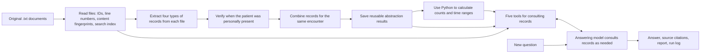

# BB Project: Reading All Runtime Code Along the Data Flow

> This document walks through the process from input documents to final answers. At each key step, it first explains the specific problem the step solves, then shows a short excerpt of real code, followed immediately by an explanation of the variables and conditions in that code. English names are retained in parentheses or code formatting to make it easy to compare them with the source. This document covers only the runtime code at commit [967b1b4](https://github.com/HuangZiheng-o-O/BB-project/tree/967b1b4862b355e625ec7e90710dc8bd029a095c).

## Architecture diagram: what each node does

Read the [architecture diagram](architecture.html) as two paths: prepare the documents once, then use the prepared results to answer new questions. The arrows show the main flow; the answering tools also read the original documents and the saved preparation results even where the diagram omits those extra arrows.

| Node in the diagram | What it does |
| --- | --- |
| **Source documents** | The original, read-only `.txt` files. They are the evidence that all later records and citations must point back to. |
| **Corpus + search** | Reads every file, gives it an ID and numbered lines, records a content fingerprint, and builds a local keyword-search index. It lets the answering model reopen the original wording. |
| **Offline abstraction** | Before questions are answered, extracts what each file says, checks whether reported times describe this patient's presence, and combines records about the same encounter while retaining conflicts. This is what **Extract, audit, reconcile** means. |
| **Validated snapshot** | Saves that preparation work as `abstraction.json`: source-linked claims, decisions about encounters, unresolved issues, source fingerprints, and the model name. “Validated” means its format, source references, and reuse conditions are checked; it does not guarantee that every interpretation is clinically correct. |
| **Deterministic totals** | Ordinary Python code calculates encounter counts, therapy days, minutes, weekly totals, and possible ranges from the prepared records. It saves the result as `calculation.json`; the answering model does not perform this arithmetic. |
| **New question** | A question supplied in the command-line question file or typed into the local web page. It does not change the saved preparation result. |
| **CLI / Gradio page** | Accepts the question and starts the answering process. The command line can process a list of questions; the web page accepts one new question at a time. |
| **Investigation agent** | The answering model decides what to inspect for this question, calls evidence tools as needed, and writes an answer with original-file line citations. |
| **Evidence tools** | Five ways for the agent to inspect original text, prepared records, and calculated results; see the table below. |
| **Answer + audit** | Saves the answer, a readable Markdown report with cited original lines, and a trace of model and tool activity so the result can be reviewed. These are output files, not a separate database. |

The **Evidence tools** node contains five actions:

| Tool | What it returns and when it helps |
| --- | --- |
| `search` | Ranks potentially relevant original lines by keywords. Its limited results cannot prove that every matching record was found. |
| `open_source` (shown as **open**) | Opens specific numbered lines of an original file to check exact wording and context. |
| `related` | Shows all extracted records linked to one encounter, the combined decision, and original excerpts; useful when records disagree. |
| `scan` | Pages through a complete **prepared inventory**, such as encounters, measures, or observations. It cannot recover an item that was never extracted from the original text. |
| `calculate` | Reads selected parts of the already calculated results. Despite its name, this tool does not calculate minutes when called. |

The diagram's **SRC 3** badge on a node means that the diagram links to three relevant *source-code locations*; it does not mean three clinical documents were processed. Likewise, a **Database** icon denotes saved data in this diagram: the snapshot and final output are files, while the local SQLite database is the search index.

## 0. Start with a Map of the Runtime

The project can run from the command line or through a local question-answering web page. `bb-review` is the command-line entry point, and `bb-review-web` is the web entry point; both ultimately use the same code to read documents, calculate results, and answer questions. The entry-point names are specified in the project's script configuration. Python 3.11 or later is required; the model client uses `anthropic` or `openai`, field validation uses `pydantic`, and the web page additionally requires `gradio`. The database, file hashing, and date calculations mainly use Python's standard library.



First, distinguish the two stages. **Preparation stage (often called offline in the code)**: read the original documents, ask the model to identify encounters, treatment goals, scales (forms used to record symptoms or assessment scores), and other records in each file, then combine records for the same encounter and save them as `abstraction.json`. **Question-answering stage (online)**: the user enters a new question, and the answering model consults the abstracted data and original text as needed before writing an answer. The first run usually prepares the data before answering questions; specifying `--snapshot` allows reuse of previously prepared results, but the program still rechecks the current source documents and recalculates statistics.

Consider a hypothetical example that will recur throughout this document: a schedule says “group therapy scheduled for Tuesday, 09:00–10:00”; a sign-in sheet says “patient arrived at 09:15”; a treatment note says “actually participated until 09:50”; and a bill says “charged for 60 minutes.” All these files discuss the same group therapy session, but each file cannot be counted as a new session, nor can the 60 minutes on the bill simply be accepted. The program first preserves **what each file says**, then determines which records refer to the same session and how long the patient actually participated. Only then does Python calculate minutes and counts. Below, an appointment, an encounter, or a treatment service is collectively called an **encounter**: one matter to be verified. `EventMention` represents “what one file says about this matter”; `ResolvedEvent` represents “the determination made about this matter after considering multiple files.”

Keep two other names in mind: `Corpus` is the **collection of original files** read for this run, including file IDs, line numbers, and a search index. `ReviewSnapshot` is the **result of the preparation stage**, bringing together records extracted from files, consolidated determinations, the model used, and file fingerprints. It is not an answer to a user's question, nor does it replace the original files. The program writes it to `abstraction.json`; when another question is asked later, it verifies that the files are still the same version before reusing it.

### 0.1 What Documents Become During Preparation

**The original `.txt` files are not replaced.** The program separately builds a searchable index of the original text and organizes specific statements in the documents into data with source references. The three principal resulting files are:

| File | What it contains | How it helps answer new questions |
| --- | --- | --- |
| `index.sqlite3` | IDs and file information for each source document, plus a line-by-line search index. The original text can still be opened by “file ID + line number.” | Find potentially relevant lines by keyword, or open a specified file to verify its wording. |
| `abstraction.json` | Statements the model extracted from each file, consolidated determinations about the same encounter, unresolved disputes, and content fingerprints of the source files. Every extracted result points back to a source file and line numbers. | Avoid having the model reread and reorganize every document for each question. |
| `calculation.json` | Per-encounter, daily, and weekly data calculated by Python from the organized records, along with possible ranges when evidence is insufficient. | Consult already calculated results when answering questions about counts, days, and minutes. |

Creating `abstraction.json` has three steps. First, [`extract_corpus()`](https://github.com/HuangZiheng-o-O/BB-project/blob/967b1b4862b355e625ec7e90710dc8bd029a095c/bb/extract.py#L116-L228) sends the line-numbered source text to the model in batches to identify four types of content: what each file says about an encounter or appointment, treatment-plan goals, scale records, and other clinical observations. At this point it preserves only **what each file says individually**, without making a final determination between conflicting files. Second, [`audit_time_scope()`](https://github.com/HuangZiheng-o-O/BB-project/blob/967b1b4862b355e625ec7e90710dc8bd029a095c/bb/time_audit.py#L26-L151) checks whether times in certain group therapy records refer to the whole activity or to the time this patient was actually present. Third, [`reconcile_events()`](https://github.com/HuangZiheng-o-O/BB-project/blob/967b1b4862b355e625ec7e90710dc8bd029a095c/bb/reconcile.py#L107-L269) groups statements referring to the same encounter and records the consolidated determination, supporting and opposing statements, and any differences that cannot be resolved.

For example, a schedule says “treatment scheduled for 14:00–14:45,” another record says “patient canceled in advance,” and a billing record shows “posted to account.” The program first preserves **what each of these three files says and the lines where it says it**. It then determines that they refer to the same appointment and uses the evidence to decide whether treatment actually took place. A billing record alone cannot prove that the patient received treatment. This consolidated determination becomes the input for subsequent calculations.

```text
Original .txt documents
  ├─→ index.sqlite3: searchable original text that can be opened by line
  └─→ Statements from each file → time audit → consolidated determination for the same encounter
                                          └─→ abstraction.json
                                                └─→ Python calculations → calculation.json
```

These three results serve different purposes. `abstraction.json` is not a general document summary; it is a collection of records with fixed fields that can lead back to the original text. Nor are the numbers in `calculation.json` mental arithmetic performed by the model. During online answering, the program can consult both the organized results and the original text. If a new question concerns a concept not captured during preparation, the answering model must still search and open the original text; it cannot treat the organized results as a complete substitute for the entire document collection.

## 1. From Command-Line Arguments to a Run

[`bb.cli.main`](https://github.com/HuangZiheng-o-O/BB-project/blob/967b1b4862b355e625ec7e90710dc8bd029a095c/bb/cli.py#L202-L228) reads command-line arguments. The two most common inputs are `--documents` (the folder of original `.txt` files) and `--questions` (the question list). `--prepare-only` means to organize the files without answering questions yet; `--snapshot` means to use the previously created `abstraction.json`. `--start` and `--end` define the statistical date range, limiting the period of treatment included in calculations. `--provider`, `--model`, and `--base-url` select the model service. Other arguments control how much text is sent to the model at a time and the maximum number of tool and model calls per question. The program rejects combinations that conflict or lack required inputs.

[`_read_questions`](https://github.com/HuangZiheng-o-O/BB-project/blob/967b1b4862b355e625ec7e90710dc8bd029a095c/bb/cli.py#L33-L48) converts entries in the question file to a consistent “question ID + question text” form. An entry can be a string or an object containing a `question` field; if it has no ID, the program assigns `Q-001`, `Q-002`, and so on. This step only checks the input format; it does not choose an answer or a fixed workflow based on the question ID.

[`_run_directory`](https://github.com/HuangZiheng-o-O/BB-project/blob/967b1b4862b355e625ec7e90710dc8bd029a095c/bb/cli.py#L51-L59) creates a new results folder for every run to avoid overwriting previous results. The main function `run` then proceeds in order: read and index the source documents → create the model client → organize the documents or load previous results → calculate statistics → investigate and answer each question → write answers, evidence, and logs. In the code below, `args` holds the command-line arguments, `output` is the new results folder, and `snapshot` is the `ReviewSnapshot` result described above.

**Code excerpt (`bb/cli.py:75-86`):**

```python
    progress("Indexing source documents")
    # Corpus reads originals and builds a local line-level search index.
    corpus = Corpus(args.documents, output / "index.sqlite3")
    # Model is one provider adapter shared by offline and online stages.
    model = make_model(args.provider, args.model, args.base_url)
    # Trace accumulates model and validation activity for the complete run.
    trace: list[dict[str, Any]] = []
    if args.snapshot:
        progress("Validating reusable abstraction")
        # Snapshot reuse requires matching model identity and source hashes.
        snapshot = ReviewSnapshot.model_validate_json(args.snapshot.read_text(encoding="utf-8"))
        validate_snapshot_reuse(snapshot, args.model, corpus.manifest())
```

Line by line: `corpus = Corpus(...)` reads the files and creates a local line-number index; `model = make_model(...)` creates a model client using the command-line settings; and `trace` is an empty run-log list that later records model calls and validation results. When `args.snapshot` has a value, `model_validate_json` reads the old `abstraction.json` into a `ReviewSnapshot` object. Finally, `corpus.manifest()` provides the current ID and content fingerprint of each file; `validate_snapshot_reuse` uses them to confirm that the old results belong to this set of files and the current model.

### 1.1 How the Model Interface Is Selected at the Entry Point

Different model services have different call formats, but the subsequent organization and answering code should not need a separate implementation for each one. [`make_model`](https://github.com/HuangZiheng-o-O/BB-project/blob/967b1b4862b355e625ec7e90710dc8bd029a095c/bb/model_provider.py#L343-L349) creates the appropriate client based on `--provider`; [`ModelPort.generate`](https://github.com/HuangZiheng-o-O/BB-project/blob/967b1b4862b355e625ec7e90710dc8bd029a095c/bb/model_provider.py#L32-L46) defines a common input and output format. Every model call returns a `ModelTurn`: the text response, tools the model requests, token usage (the unit used to measure text processed by the model), and data needed to continue the conversation. Other modules therefore handle only one format.

**Code excerpt (`bb/model_provider.py:21-29`):**

```python
@dataclass(frozen=True)
class ModelTurn:
    """Normalize text, tool requests, usage, and continuation state."""

    text: str
    tool_calls: list[ToolCall] = field(default_factory=list)
    usage: dict[str, int] = field(default_factory=dict)
    stop_reason: str = ""
    response_items: list[Any] = field(default_factory=list)
```

The object's fields can be read individually: `text` is the text written by the model; `tool_calls` contains the lookup actions it asks the program to perform; `usage` records how many tokens the call used; `stop_reason` says why the turn stopped; and `response_items` retains provider data needed for the next turn. For example, when the model requests “open a particular file,” the subsequent answering workflow only needs to inspect the standardized `tool_calls`, not understand the provider's raw format.

When an Anthropic-format interface is selected, [client initialization](https://github.com/HuangZiheng-o-O/BB-project/blob/967b1b4862b355e625ec7e90710dc8bd029a095c/bb/model_provider.py#L49-L68) reads the key and address from environment variables. If the model requests a tool call, the adapter converts it to Anthropic's `tool_use`; it then sends the tool's execution result back to the model as `tool_result`. This conversion is in the [message-mapping code](https://github.com/HuangZiheng-o-O/BB-project/blob/967b1b4862b355e625ec7e90710dc8bd029a095c/bb/model_provider.py#L70-L148). Here, `json_mode` does not directly invoke a dedicated Anthropic structured-output feature; the JSON returned by the model still has to be parsed and validated afterward.

When an OpenAI-compatible interface is selected, the program first examines the actual request URL. If the URL is for `api.z.ai`, it reads `ZAI_API_KEY`; otherwise, it reads `OPENAI_API_KEY`. This prevents the keys for the two services from being mixed up; see [credential selection](https://github.com/HuangZiheng-o-O/BB-project/blob/967b1b4862b355e625ec7e90710dc8bd029a095c/bb/model_provider.py#L151-L174). The code then chooses the appropriate OpenAI SDK call method based on the URL and model name, and converts model tool-call results to the common `ModelTurn` format. These differences are encapsulated in the adapter, so the modules that organize files and answer questions do not need to account for them.

**Code excerpt (`bb/model_provider.py:158-167`):**

```python
        # Endpoint chooses the compatible service used by this adapter.
        endpoint = base_url or os.getenv("OPENAI_BASE_URL")
        if not endpoint and not os.getenv("OPENAI_API_KEY"):
            endpoint = os.getenv("ZAI_BASE_URL")
        # Key name follows the effective host so credentials are not mixed.
        key_name = "ZAI_API_KEY" if endpoint and urlparse(endpoint).hostname == "api.z.ai" else "OPENAI_API_KEY"
        # Key is read only at client construction, never written to artifacts.
        key = os.getenv(key_name)
        if not key:
            raise RuntimeError(f"Set {key_name}")
```

`endpoint` is the service URL to which the request will be sent. The code uses the URL's hostname to decide which key to retrieve; a missing key produces an error immediately. The key is read only when the client is created and is not written to the results files.

When the model uses tools over multiple turns, the next turn must include the previous call content and the tool result just obtained. The Responses adapter stores this content in `response_items` and includes it in the next request. It also sets `store` to `False` and passes the output-length and reasoning-effort settings as specified in the code. This is the implementation branch used for particular models at the official OpenAI URL.

The preparation stage requires the model to return JSON (a text format that organizes data into fields). [`parse_json_object` and `generate_json`](https://github.com/HuangZiheng-o-O/BB-project/blob/967b1b4862b355e625ec7e90710dc8bd029a095c/bb/model_provider.py#L352-L397) first remove any Markdown code fences that may have been included, then attempt to parse the result. If its format is invalid, they send the parsing error back to the model and retry. A successful parse establishes only that the format is valid; if, for example, the model supplies a file ID that does not exist, a later source-reference check must catch it.

## 2. How Original Documents Become a Traceable `Corpus`

[`Source`](https://github.com/HuangZiheng-o-O/BB-project/blob/967b1b4862b355e625ec7e90710dc8bd029a095c/bb/source.py#L17-L36) represents an original file. In addition to its path, it stores a file identifier, `source_id`; a fingerprint (hash) of the file’s original contents; and the text split into lines. When the program displays the text, it adds line numbers such as `L0001` and `L0002`. For example, `[NOTE-01:L12]` in an answer means “line 12 of file NOTE-01.” This numbering is used throughout model input, tool results, and the final report.

[`Corpus._load`](https://github.com/HuangZiheng-o-O/BB-project/blob/967b1b4862b355e625ec7e90710dc8bd029a095c/bb/source.py#L39-L108) recursively finds `.txt` files in the document directory and reads them one by one. If a file contains `Document ID: NOTE-01`, that value becomes its file identifier; otherwise, the filename is used. A path hash is appended to duplicate identifiers so that two files are not confused. The program also checks that a symbolic link cannot lead outside the specified directory. Each line is added to a SQLite full-text search table for this run, allowing later keyword searches. SQLite is a local database; there is no remote search service or vector retrieval here.

**Code excerpt (`bb/source.py:70-83`):**

```python
            if path.is_symlink():
                raise ValueError(f"Symlink sources are not accepted: {path}")
            # Resolve again after the symlink check to enforce the corpus root.
            absolute = path.resolve(strict=True)
            if not absolute.is_relative_to(self.documents):
                raise ValueError(f"Source escaped document root: {path}")
            # Hash raw bytes so any source edit invalidates a saved snapshot.
            raw = absolute.read_bytes()
            # UTF-8 with an optional byte-order mark is the accepted input format.
            content = raw.decode("utf-8-sig")
            # Splitlines preserve the one-based positions used by citations.
            lines = tuple(content.splitlines())
            # Prefer the document's declared ID over its filename stem.
            match = re.search(r"^Document ID:\s*(\S+)", content, re.MULTILINE)
```

`raw` contains the file’s original bytes and is used to calculate the content fingerprint: if the file contents change, the fingerprint changes. `content` is the decoded text; `lines` splits it into individual lines for the model to cite. `match` attempts to find a file identifier from `Document ID:` in the text; the filename is used only if none is found. The file identifier specifies “which file” and is different from an appointment or encounter identifier.

The [`Corpus` reading and citation methods](https://github.com/HuangZiheng-o-O/BB-project/blob/967b1b4862b355e625ec7e90710dc8bd029a095c/bb/source.py#L110-L141) each have a distinct purpose: `manifest()` provides a list mapping file identifiers to file hashes; `open()` shows the model the numbered original text of a specified file; `quote()` retrieves the original wording by line number; and `validate_anchor()` checks whether a file identifier and line number actually exist. Note that the program can confirm that `[NOTE-01:L12]` points to a real line, but the address alone cannot establish that the line supports a claim in the answer.

[`search`](https://github.com/HuangZiheng-o-O/BB-project/blob/967b1b4862b355e625ec7e90710dc8bd029a095c/bb/source.py#L143-L178) uses SQLite full-text search to find potentially relevant lines of original text. It takes up to 12 words from the question, ranks matching lines by relevance using full-text search, and returns only the first portion. For example, searching for “group therapy” can help locate potentially relevant lines, but those results alone cannot establish how many therapy sessions the documents contain in total; later-ranked records may not be returned. When a complete item-by-item review is needed, the answering model should use `scan`, described later.

**Code excerpt (`bb/source.py:145-153`):**

```python
        # Use lexical tokens as candidate terms, not as a complete answer set.
        tokens = re.findall(r"[\w]+", query, flags=re.UNICODE)
        if not tokens:
            return []
        tokens = tokens[:12]
        # Quote terms so user punctuation cannot alter the FTS query structure.
        fts_query = " OR ".join(f'"{token}"' for token in tokens)
        # Optional source restriction is applied after SQLite ranking.
        permitted = set(source_ids) if source_ids is not None else None
```

`tokens` contains search terms extracted from the query text. The code takes only the first 12 and joins them with `OR` to find potentially relevant lines quickly. This function’s results are “search leads,” not the complete set of records.

There may be too many original files to fit into a single model request. [`extraction_batches` and `_source_parts`](https://github.com/HuangZiheng-o-O/BB-project/blob/967b1b4862b355e625ec7e90710dc8bd029a095c/bb/source.py#L180-L223) divide files into batches by character count. If an individual file is too long, it is split only between lines, never in the middle of a line. Each part retains its file identifier and original line numbers so it can be checked later. The default `max_chars=13500` is an approximate character limit per batch, not an exact token limit. The program passes all discovered text through the preparation stage in sequence; it does not first select files based on the current question.


## 3. What Types of Records the Program Stores

Model-generated content must first be converted into data objects that the program can check. These objects are defined in [`bb/models.py`](https://github.com/HuangZiheng-o-O/BB-project/blob/967b1b4862b355e625ec7e90710dc8bd029a095c/bb/models.py#L1-L354), using Pydantic to check required fields, date and time formats, and citation formats. The table below lists the object types in order from original text to final determination. When reading it, keep this distinction in mind: **`Mention` represents what one file says; `ResolvedEvent` represents the determination the program stores about the same encounter after considering multiple files together.**

| Code name | Plain-language meaning | Why it is stored |
| --- | --- | --- |
| [`TimeSpan`](https://github.com/HuangZiheng-o-O/BB-project/blob/967b1b4862b355e625ec7e90710dc8bd029a095c/bb/models.py#L13-L25) | A start-to-end time interval | Start and end times, such as 09:00–09:30. |
| [`Anchor`](https://github.com/HuangZiheng-o-O/BB-project/blob/967b1b4862b355e625ec7e90710dc8bd029a095c/bb/models.py#L74-L99) | An address in the original text | Which file and which lines; citations in answers use it to return to the original text. |
| [`EventMention`](https://github.com/HuangZiheng-o-O/BB-project/blob/967b1b4862b355e625ec7e90710dc8bd029a095c/bb/models.py#L102-L156) | One encounter record in one file | What the file says, which appointment or treatment it concerns, and where it appears in the original text. |
| [`PlanGoal`](https://github.com/HuangZiheng-o-O/BB-project/blob/967b1b4862b355e625ec7e90710dc8bd029a095c/bb/models.py#L159-L213) | A plan goal | For example, “at least 3 days and 180 minutes per week.” |
| [`MeasureMention`](https://github.com/HuangZiheng-o-O/BB-project/blob/967b1b4862b355e625ec7e90710dc8bd029a095c/bb/models.py#L216-L248) | One assessment-scale record | Form identifier, completion date, and score; copies are identified as such. |
| [`Observation`](https://github.com/HuangZiheng-o-O/BB-project/blob/967b1b4862b355e625ec7e90710dc8bd029a095c/bb/models.py#L251-L276) | Other written observations | For example, observations in a therapy note; they do not themselves add therapy minutes. |
| [`BatchExtraction`](https://github.com/HuangZiheng-o-O/BB-project/blob/967b1b4862b355e625ec7e90710dc8bd029a095c/bb/models.py#L279-L285) | First-pass extraction results | Collects encounters, goals, assessments, and observations extracted from all files. |
| [`ResolvedEvent`](https://github.com/HuangZiheng-o-O/BB-project/blob/967b1b4862b355e625ec7e90710dc8bd029a095c/bb/models.py#L288-L306) | A combined determination about the same encounter | Whether it was therapy, whether the patient participated, credible time intervals, and contrary evidence. |
| [`Reconciliation`](https://github.com/HuangZiheng-o-O/BB-project/blob/967b1b4862b355e625ec7e90710dc8bd029a095c/bb/models.py#L309-L313) | The consolidated results for this set of encounters | `events` holds the combined determination for each encounter; `unresolved_mention_ids` holds identifiers of original records that could not be assigned to a result. |
| [`AuditFinding`](https://github.com/HuangZiheng-o-O/BB-project/blob/967b1b4862b355e625ec7e90710dc8bd029a095c/bb/models.py#L316-L321) | An issue requiring attention | Records errors or insufficient evidence and identifies the original text involved. |
| [`ReviewSnapshot`](https://github.com/HuangZiheng-o-O/BB-project/blob/967b1b4862b355e625ec7e90710dc8bd029a095c/bb/models.py#L324-L331) | Preparation results that can be retained for a later question | Stores the records and determinations above, the original file fingerprints, and the model name. |

**Code excerpt (`bb/models.py:102-121`):**

```python
class EventMention(BaseModel):
    """One source's claim about an encounter, before conflict resolution."""

    source_id: str
    lines: list[int] = Field(min_length=1, max_length=12)
    patient_id: str | None = None
    encounter_id: str | None = None
    appointment_id: str | None = None
    service_date: str | None = None
    service_type: str | None = None
    document_role: str = Field(description="clinical, attendance, schedule, correction, charge, draft, or administrative")
    status: str = Field(description="What this source asserts, not the reconciled event status")
    patient_present: bool | None = None
    actual_intervals: list[TimeSpan] = Field(default_factory=list)
    scheduled_intervals: list[TimeSpan] = Field(default_factory=list)
    nontherapy_intervals: list[TimeSpan] = Field(default_factory=list)
    correction_field: str | None = None
    correction_value: str | None = None
    duplicate_of: str | None = None
    note: str = ""
```

The `EventMention` defined here corresponds to “one encounter mentioned in one file.” `source_id` and `lines` identify the file and lines containing the original wording. `patient_id` is the patient identifier; `encounter_id` identifies a clinical encounter; and `appointment_id` identifies an appointment. `document_role` indicates whether the file is a therapy note, schedule, bill, or correction; `status` stores **the status claimed by that file**. `actual_intervals` contains the periods during which the file claims the patient actually participated, `scheduled_intervals` contains the scheduled times, and `nontherapy_intervals` contains periods that should not count as therapy. `correction_field` and `correction_value` record which field was corrected and its new value. At this point, the original text is merely being preserved faithfully; no determination has been made about which time interval should ultimately be counted.

The model might write file line numbers as `3` or as `L0003-L0006`. [`_source_lines`](https://github.com/HuangZiheng-o-O/BB-project/blob/967b1b4862b355e625ec7e90710dc8bd029a095c/bb/models.py#L47-L71) normalizes them to integers; `Anchor` then rejects negative numbers, excessively long ranges, and duplicate lines. Dates must be valid calendar dates, and times must use the 24-hour format. There is a second check afterward: `Corpus.validate_anchor` confirms that the file identifier exists and that the line numbers do not exceed the file’s length. The first check asks whether a citation “looks valid”; the second checks whether it “actually points to the original text in this run.”

**Code excerpt (`bb/models.py:74-93`):**

```python
class Anchor(BaseModel):
    """Small, validated set of one-based lines from one original source."""

    source_id: str
    lines: list[int] = Field(min_length=1, max_length=12)

    @field_validator("lines", mode="before")
    @classmethod
    def parse_lines(cls, value: object) -> object:
        """Accept integer lines and compact line labels from model output."""
        return _source_lines(value)

    @field_validator("lines")
    @classmethod
    def positive_lines(cls, values: list[int]) -> list[int]:
        """Canonicalize lines for stable references and duplicate removal."""
        # Value is each requested one-based line number.
        if any(value < 1 for value in values):
            raise ValueError("Source line numbers must be positive")
        return sorted(set(values))
```

For example, if the model supplies `lines=[4, 4, 2]`, this code normalizes it to `[2, 4]`; specifying line 0 produces an error. But whether the file represented by `source_id` actually exists must be checked separately by `Corpus`.

When a later question seeks to reuse the preparation results, [`validate_snapshot_reuse`](https://github.com/HuangZiheng-o-O/BB-project/blob/967b1b4862b355e625ec7e90710dc8bd029a095c/bb/models.py#L334-L354) compares the model name and the list of hashes for every original file, and checks whether the previous run left an error flag that prevents reuse. If any condition fails, preparation must be repeated. This cannot prove that the model’s earlier medical determinations were absolutely correct; it prevents preparation results from a different version of the files from being mixed into the current answer.

## 4. First, organize the source text: identify what each file says

The first model pass **records what appears in each source document**, without yet answering the user's questions. [`EXTRACTION_SYSTEM`](https://github.com/HuangZiheng-o-O/BB-project/blob/967b1b4862b355e625ec7e90710dc8bd029a095c/bb/extract.py#L18-L34) requires four categories of information: `events` are encounters, appointments, and similar events; `goals` are treatment goals; `measures` are assessment-scale records; and `observations` are other clinical narratives. Each item must include the file identifier and source line number. The prompt also requires distinguishing “scheduled time” from “time the patient actually participated.” Corrections, billing records, drafts, and similar material must be recorded for what they are, rather than treated directly as completed treatment.

[`extract_corpus`](https://github.com/HuangZiheng-o-O/BB-project/blob/967b1b4862b355e625ec7e90710dc8bd029a095c/bb/extract.py#L116-L188) starts with the document batches produced in the previous section and asks the model to extract these four categories from each batch. It first checks each batch for a usable cache entry; even cached content is checked again. It calls the model only if no usable result exists. Model output must pass field and source-line checks; if it fails, the specific errors are sent back to the model for correction. Only then does processing move to the next batch. This process handles the entire batch of files, regardless of which questions are currently listed.

**Code excerpt (`bb/extract.py:156-172`):**

```python
        # Allowed source IDs come from the numbered documents in this batch.
        allowed = set(re.findall(r"^DOCUMENT (\S+)", batch, re.MULTILINE))
        # Cache path encodes model, prompt, and exact batch contents.
        cache_path = cache.path("extract", model.model_name, EXTRACTION_SYSTEM, batch) if cache else None
        # Result is a previously validated candidate or a fresh model response.
        result = cache.read(cache_path) if cache_path else None
        if result is not None and _payload_errors(result, corpus, allowed):
            result = None
        if result is None:
            # Calls records model attempts, including repair turns.
            result, calls = generate_checked_json(
                model,
                EXTRACTION_SYSTEM,
                f"Extract evidence from source batch {batch_number}/{len(batches)}:\n\n{batch}",
                lambda data: _payload_errors(data, corpus, allowed),
                max_tokens=10000,
            )
```

`batch` is a numbered segment of source text sent to the model in this pass, and `allowed` contains the file identifiers that actually appear in it. `cache_path` points to a possible result from a previous run on that segment; `result` is the old result read from it. If the old result cites the wrong file or has invalid fields, it is discarded and the model is called again. After `generate_checked_json` produces a new result, it calls this step's validation function; `calls` retains the model-call records.

[`_validated_items`](https://github.com/HuangZiheng-o-O/BB-project/blob/967b1b4862b355e625ec7e90710dc8bd029a095c/bb/extract.py#L53-L88) checks the extracted records one by one: all four result categories must be arrays; each item must conform to its corresponding data class; cited files must be in **this batch**, and line numbers must actually exist. Why require “this batch”? Even if the model gives the identifier of another real file in the system, it did not see that file's source text in this request, so the citation cannot be treated as reliable evidence from this pass. Invalid records produce error messages for the correction step.

**Code excerpt (`bb/extract.py:73-79`):**

```python
            item = model_type.model_validate(raw)
            anchor = item.anchor()
            if anchor.source_id not in allowed_sources:
                raise ValueError(f"{anchor.source_id} was not in this extraction batch")
            corpus.validate_anchor(anchor)
            if isinstance(item, EventMention):
                item.finalize_id()
```

`model_validate` checks a record's fields; `allowed_sources` checks whether the model actually saw the cited file; `validate_anchor` checks the line number. Only after passing all three checks does an event record receive a stable `mention_id` for tracking later.

### 4.1 Check source identifiers for missed encounter records

Some files explicitly state an encounter identifier, such as `Encounter ID: ENC-001`; an appointment schedule may instead state `Appointment ID: APT-001`. An **encounter identifier** identifies an actual service, while an **appointment identifier** identifies an appointment in the scheduling system. They come from the source files, are not arbitrarily invented by the program, and are not the file identifier `source_id`. A clinical note and appointment schedule for the same service may each give a different kind of identifier. After extraction, [`_explicit_contact_ids`](https://github.com/HuangZiheng-o-O/BB-project/blob/967b1b4862b355e625ec7e90710dc8bd029a095c/bb/extract.py#L37-L47) scans each source document again for explicitly labeled identifiers of these kinds and checks whether the extraction retained them. If the source contains `ENC-001` but the extraction does not, the program sends that file back to the model with a specific request to restore the missed encounter record. If that attempt also fails, this stage stops.

This check recognizes only the identifier formats specified in the code. For example, if a free-text passage does not say “Encounter ID,” the program cannot use identifiers alone to determine whether an event in it was missed. The identifier check is therefore **an additional signal of possible omissions**, not proof that “all information in every document has been fully extracted.”

**Code excerpt (`bb/extract.py:189-206`):**

```python
    # Source is each original document checked for omitted labeled events.
    for source in corpus.sources.values():
        # Explicit IDs provide a source-grounded recall signal independent of search ranking.
        # Compare IDs visible in the original text with the extracted claims.
        explicit_ids = _explicit_contact_ids("\n".join(source.lines))
        # Extracted IDs are the encounters already represented for this source.
        extracted_ids = {
            # Identity is an encounter or appointment ID in one extracted claim.
            identity
            for item in all_events if item.source_id == source.source_id
            for identity in (item.encounter_id, item.appointment_id) if identity
        }
        # Missing IDs trigger one focused source-level recovery pass.
        missing_ids = explicit_ids - extracted_ids
        if not missing_ids:
            continue
        if progress:
            progress(f"Checking event coverage for source {source.source_id}: {len(missing_ids)} unrepresented IDs")
```

`explicit_ids` comes from encounter or appointment identifiers expressly written in the source files; `extracted_ids` comes from records the model has already extracted. The difference is `missing_ids`: identifiers present in the source but without corresponding records in the result. Only these gaps trigger another model correction targeted at the relevant file.

### 4.2 General model-based correction after failure

[`generate_checked_json`](https://github.com/HuangZiheng-o-O/BB-project/blob/967b1b4862b355e625ec7e90710dc8bd029a095c/bb/repair.py#L15-L63) is a general “generate → check → correct” loop. The step calling it supplies the source text, the task instructions for the model, and a validation function. After the model returns JSON, the validation function identifies specific errors. If there are errors, the next pass sends both the source text and those errors back to the model. By default, there are at most three rounds of stage-level validation; within each round, unparseable JSON may also trigger additional retries. If the result remains invalid after three rounds, the process stops with an error rather than passing bad data to later steps.

**Code excerpt (`bb/repair.py:29-49`):**

```python
    # Trace records every model attempt and validation decision.
    trace: list[dict[str, Any]] = []
    # Feedback is empty on the first pass and carries validator errors later.
    feedback = ""
    for attempt in range(1, attempts + 1):
        # Prompt always includes the original evidence plus any repair feedback.
        prompt = source_prompt + feedback
        try:
            # Result is a JSON candidate; calls captures its model usage.
            result, calls = generate_json(model, system, prompt, max_tokens=max_tokens)
        except ValueError as error:
            # Errors also covers invalid JSON before domain validation can run.
            errors = [str(error)]
            result, calls = {}, []
        else:
            errors = validate(result)
        # Call is one model attempt annotated with its validation pass.
        trace.extend({**call, "validation_attempt": attempt} for call in calls)
        trace.append({"stage": "validation", "validation_attempt": attempt, "errors": errors})
        if not errors:
            return result, trace
```

`feedback` is initially empty and contains the previous round's errors from the second round onward. `prompt = source_prompt + feedback` ensures that the model still sees the original evidence when correcting its output, rather than only a message saying “please retry.”

`repair.py` itself does not know what constitutes treatment or a valid time. The extraction step checks citations, the time-audit step checks that every event receives a conclusion, and the reconciliation step checks that no records for the same encounter are omitted. They share the same retry mechanism, so corrections address data problems found by each step rather than adding an ad hoc hint for a particular question.

### 4.3 Why the cache does not carry an old answer into a new question

[`StageCache`](https://github.com/HuangZiheng-o-O/BB-project/blob/967b1b4862b355e625ec7e90710dc8bd029a095c/bb/cache.py#L11-L45) is an optional cache for processing stages. It hashes the current step, model name, task prompt, and input source text together to form the cache filename. If the input or model changes, the old file will not match; a damaged file is also treated as a cache miss. It is used only when `--reuse-cache` is enabled, and content read from it must pass the current step's checks again. The cache stores intermediate preparation results, not answers to user questions.

**Code excerpt (`bb/cache.py:19-37`):**

```python
    def path(self, stage: str, model: str, prompt: str, payload: str) -> Path:
        """Include the model and exact inputs so stale results miss the cache."""
        # Key serializes all inputs that can change the model-stage result.
        key = json.dumps([stage, model, prompt, payload], ensure_ascii=False)
        # Digest produces a stable, file-safe cache identity.
        digest = sha256(key.encode()).hexdigest()
        return self.directory / f"{stage}-{digest}.json"

    @staticmethod
    def read(path: Path) -> dict[str, Any] | None:
        """Treat absent or malformed entries as misses for safe recovery."""
        if not path.exists():
            return None
        try:
            # Value is trusted only after parsing and checking its top-level type.
            value = json.loads(path.read_text(encoding="utf-8"))
        except (OSError, UnicodeError, json.JSONDecodeError):
            return None
        return value if isinstance(value, dict) else None
```

`path()` generates a filename tied to the input; `read()` returns an empty value when a file is missing or invalid so that the caller can process it again. The caller remains responsible for deciding whether the cached content is substantively valid.

## 5. The duration of a group treatment session is not necessarily the patient's attendance time

Group treatment records can be confusing: a file may say “activity 09:00–10:00,” while the patient may not have arrived until 09:20. [`audit_time_scope`](https://github.com/HuangZiheng-o-O/BB-project/blob/967b1b4862b355e625ec7e90710dc8bd029a095c/bb/time_audit.py#L22-L135) performs an additional check between extraction and reconciliation. It selects only records from clinical files whose service name contains `group` and that have both an “actual time” and a “scheduled time,” then gives the model both the record and the full source document to assess. Here, `mention_id` identifies the extracted record itself, ensuring that the returned assessment corresponds to the right record; it differs from both the appointment and encounter identifiers in the file.

**Code excerpt (`bb/time_audit.py:30-39`):**

```python
    # Candidates have both group schedule and claimed patient-contact intervals.
    candidates = [
        mention for mention in extraction.events
        if mention.document_role == "clinical"
        and "group" in (mention.service_type or "").lower()
        and mention.actual_intervals
        and mention.scheduled_intervals
    ]
    if not candidates:
        return [], []
```

`candidates` contains only records requiring this check. For example, if a file has only a scheduled time and no extracted “actual time,” it will not enter this specialized audit function. This step should not be taken to mean that all times have been validated again.

[`TIME_SCOPE_SYSTEM`](https://github.com/HuangZiheng-o-O/BB-project/blob/967b1b4862b355e625ec7e90710dc8bd029a095c/bb/time_audit.py#L16-L19) reminds the model that the start and end of a group treatment session, or a facilitator's working hours, cannot automatically be treated as the time a particular patient attended throughout. The model must give each record a conclusion: `true` means the extracted time does refer to the patient; `false` means it is actually the activity's or staff's time; and `null` means the evidence is insufficient. [`validation_errors`](https://github.com/HuangZiheng-o-O/BB-project/blob/967b1b4862b355e625ec7e90710dc8bd029a095c/bb/time_audit.py#L65-L88) checks that every record awaiting review receives exactly one valid conclusion, with no omissions or duplicates.

If the conclusion is `false`, the program clears that record's `actual_intervals` so the incorrect time is not counted as treatment minutes later. It also retains a `time_scope_reclassified` audit record explaining why the originally extracted time was withdrawn. If the conclusion is `null`, the original value is provisionally retained, but a `time_scope_uncertain` audit record is written; later statistics will flag that the overall result may be incomplete. This changes only the organized results in memory; the original `.txt` files remain unchanged. See [result handling](https://github.com/HuangZiheng-o-O/BB-project/blob/967b1b4862b355e625ec7e90710dc8bd029a095c/bb/time_audit.py#L102-L135).

**Code excerpt (`bb/time_audit.py:111-131`):**

```python
        verdict = decision.get("patient_actual_supported")
        if verdict is False:
            # Remove unsupported patient intervals before reconciliation and arithmetic.
            # Original saves the rejected intervals in the audit detail.
            original = [item.model_dump() for item in mention.actual_intervals]
            mention.actual_intervals = []
            findings.append(
                AuditFinding(
                    code="time_scope_reclassified",
                    detail=f"{mention.mention_id}: candidate patient intervals {original} were service-level time; {decision.get('reason', '')}",
                    source_refs=[mention.anchor().reference()],
                )
            )
        elif verdict is None:
            findings.append(
                AuditFinding(
                    code="time_scope_uncertain",
                    detail=f"{mention.mention_id}: patient-specific basis for extracted time remains unclear; {decision.get('reason', '')}",
                    source_refs=[mention.anchor().reference()],
                )
            )
```

`actual_intervals` is the field for “time the patient actually participated.” Once the time is determined to be the duration of the entire group treatment session, that field is cleared. When evidence is insufficient, the program does not arbitrarily replace it with another time; it records “cannot currently confirm” for later review.

## 6. Put files describing the same encounter together

The next task is deciding whether several files describe the same event. First, distinguish three identifiers: `source_id` identifies a file, `encounter_id` identifies an encounter, and `appointment_id` identifies an appointment. [`group_mentions`](https://github.com/HuangZiheng-o-O/BB-project/blob/967b1b4862b355e625ec7e90710dc8bd029a095c/bb/reconcile.py#L35-L67) groups records by patient identifier plus encounter identifier. If a record has only an appointment identifier, it is added to an encounter group only if that appointment uniquely maps to one encounter in the source text. If it has neither identifier, it remains in a separate group; **the same day does not mean the same treatment session**. If the patient identifier is missing, the program fills it in only when the entire batch of material clearly concerns a single patient; otherwise, it keeps the records separate.

**Code excerpt (`bb/reconcile.py:51-66`):**

```python
    for mention in extraction.events:
        # Unknown patients remain source-scoped to avoid accidental merging.
        patient = mention.patient_id or sole_patient or f"unknown:{mention.source_id}"
        if mention.encounter_id:
            # Prefer an explicit encounter ID as the event identity.
            identity = mention.encounter_id
        elif mention.appointment_id:
            # Link an appointment only when it maps to exactly one encounter.
            linked = appointment_to_encounter.get((patient, mention.appointment_id), set())
            identity = next(iter(linked)) if len(linked) == 1 else mention.appointment_id
        else:
            # A missing identity is kept separate rather than merged by date alone.
            identity = f"unlinked:{mention.mention_id}"
        # Key combines patient and event identity for collision-free grouping.
        key = f"{patient}:{identity}"
        groups[key].append(mention)
```

`identity` is the identifier used to recognize “the same encounter.” An explicit `encounter_id` is used when present; only when the record has an appointment identifier alone does the program try to find a uniquely corresponding encounter. If neither exists, it uses the record's own `mention_id` to prevent an incorrect merge.

A group may contain scheduling information, treatment records, late entries, and corrections. [`_group_payload`](https://github.com/HuangZiheng-o-O/BB-project/blob/967b1b4862b355e625ec7e90710dc8bd029a095c/bb/reconcile.py#L70-L81) brings each record together with its source excerpt, and [`_batches`](https://github.com/HuangZiheng-o-O/BB-project/blob/967b1b4862b355e625ec7e90710dc8bd029a095c/bb/reconcile.py#L84-L104) then packages multiple groups by size for the model. Evidence for and against the same encounter is not split across requests merely to fit a batch. If one encounter group alone exceeds the character budget, the current code still sends the complete group to the model in one request.

**Code excerpt (`bb/reconcile.py:84-104`):**

```python
def _batches(groups: dict[str, list[EventMention]], corpus: Corpus, max_chars: int = 18000) -> list[list[dict]]:
    """Pack complete encounter groups without splitting their evidence."""
    # Output contains completed model batches; pending is the current batch.
    output: list[list[dict]] = []
    # Pending holds complete encounter payloads awaiting submission.
    pending: list[dict] = []
    # Length tracks the serialized size of pending group payloads.
    length = 0
    for group_id, mentions in groups.items():
        # Item keeps all competing mentions of one encounter together.
        item = _group_payload(group_id, mentions, corpus)
        # Item length determines whether this group starts a new batch.
        item_length = len(json.dumps(item, ensure_ascii=False))
        if pending and length + item_length > max_chars:
            output.append(pending)
            pending, length = [], 0
        pending.append(item)
        length += item_length
    if pending:
        output.append(pending)
    return output
```

`groups` contains the groups formed in the previous step by encounter identifier; each may contain records from multiple files. `pending` is a batch of groups being prepared for the model, and `length` is the length of that batch's text. If adding the next group would exceed the character budget, the program submits the current batch first, then places the next **complete group** in a new batch.

Every encounter group must yield a `ResolvedEvent`: a judgment that integrates the files in that group. [`RECONCILIATION_SYSTEM`](https://github.com/HuangZiheng-o-O/BB-project/blob/967b1b4862b355e625ec7e90710dc8bd029a095c/bb/reconcile.py#L17-L32) requires the model to determine whether the service occurred, whether the patient actually received treatment, and which times can be used. Even if the final determination is “no treatment was provided,” the encounter group is retained so that the reason it was not counted can be explained. If two clinical records conflict about the patient's time and there is no explicit correction, the model must retain the two possible times as separate alternatives. It cannot arbitrarily choose one or add two mutually exclusive intervals together.

The model's judgment must also pass [`validated_events`](https://github.com/HuangZiheng-o-O/BB-project/blob/967b1b4862b355e625ec7e90710dc8bd029a095c/bb/reconcile.py#L138-L210): every encounter group in the batch must have a result; every source-file record must appear exactly once in either the “supporting” or “opposing” list; an event marked as a service not provided cannot simultaneously be described as confirmed patient treatment; and conflicting clinical times without an explicit correction must remain as multiple alternatives. If the model omits a group or record, or erases a conflict on its own, the program sends the specific errors back for another attempt. If it says treatment occurred but provides no calculable time, it also retains an `unquantified_event`, meaning “the event exists, but its minutes cannot be calculated.”

These program checks can catch missing groups, incorrect identifiers, and some internally contradictory output. The model must still judge from the source text “which file is more credible” and “whether treatment actually occurred.” `supporting_mentions` and `opposing_mentions` retain the original record identifiers that support and oppose the judgment, respectively. They allow later answers to trace the evidence rather than presenting an isolated conclusion.

**What exactly does `Reconciliation` contain?** It is the container for this step's overall result, not a new source file. It has only two components: `events` is the list of judgments already consolidated by encounter, each a `ResolvedEvent`; `unresolved_mention_ids` contains identifiers of original records that have not received a reconciled result. For example, if an appointment schedule and a treatment note both refer to the same encounter, they jointly correspond to one item in `events` after reconciliation. The second component is reserved in the data structure for original records that have not received a reconciled judgment.

**Code excerpt (`bb/models.py:309-313`):**

```python
class Reconciliation(BaseModel):
    """Resolved encounters plus mentions the model could not reconcile."""

    events: list[ResolvedEvent] = Field(default_factory=list)
    unresolved_mention_ids: list[str] = Field(default_factory=list)
```

Each object in `events` retains “whether treatment was provided, whether the patient participated, possible times, and supporting and opposing records.” The current code requires a valid judgment for every encounter group; if the model omits a group, it retries first and stops if the retry still fails. Therefore, **in a successfully completed preparation run, this list is usually empty**, rather than silently leaving undecided records for the answering stage. All individual-file records extracted in the previous step remain in `BatchExtraction`; reconciliation does not delete them.

## 7. Saving the Preparation Results: How the Next Question Reuses Them

Now look at the internal structure of `ReviewSnapshot`. It is a Python data object: `source_hashes` records which source files were used and their content hashes; `extraction_model` records which model organized them; `extraction` holds the records extracted from each file; `reconciliation` holds the combined assessment of the same encounter; and `findings` holds items that could not be confirmed or failed checks. The main workflow writes it to `abstraction.json`. When `--snapshot` is specified next time, the program reads that file and runs [`validate_snapshot_reuse`](https://github.com/HuangZiheng-o-O/BB-project/blob/967b1b4862b355e625ec7e90710dc8bd029a095c/bb/models.py#L334-L354); only if validation passes does it skip the model calls that would organize the files again.

**Code excerpt (`bb/models.py:324-331`):**

```python
class ReviewSnapshot(BaseModel):
    """Reusable offline abstraction bound to model and source fingerprints."""

    source_hashes: dict[str, str]
    extraction_model: str
    extraction: BatchExtraction
    reconciliation: Reconciliation
    findings: list[AuditFinding] = Field(default_factory=list)
```

These five fields make up the “preparation results.” `BatchExtraction` contains four kinds of records found in the files; `Reconciliation` contains the results of combining records for the same encounter; and `AuditFinding` contains errors or uncertainties that need attention. `ReviewSnapshot` itself does not contain the answer to a new question. When a new question arrives, the program uses it as a basis, then checks the source text and calculates statistics.

Four similar names here describe one save-and-load process: `ReviewSnapshot` is the Python **type** that defines the fields in the organized results; `snapshot` is the **variable** holding a particular set of organized results at runtime; `abstraction.json` is the **file** created by writing that variable to disk; and the command-line argument `--snapshot /a-run/abstraction.json` tells the next run **which file to read it back from**. For example, after preparing the records and then asking a new question, the program reuses those organized results while checking again whether the source files have changed.

**Code excerpt (`bb/cli.py:82-95`):**

```python
    if args.snapshot:
        progress("Validating reusable abstraction")
        # Snapshot reuse requires matching model identity and source hashes.
        snapshot = ReviewSnapshot.model_validate_json(args.snapshot.read_text(encoding="utf-8"))
        validate_snapshot_reuse(snapshot, args.model, corpus.manifest())
    else:
        # Model-derived stages are shared by every question in this run.
        # Cache directory is optional and scoped to the output root.
        cache_dir = args.output / "_stage_cache" if args.reuse_cache else None
        # Extraction contains source claims; findings and trace record issues.
        extraction, findings, extraction_trace = extract_corpus(
            corpus, model, max_chars=args.batch_chars,
            cache_dir=cache_dir, progress=progress,
        )
```

`if args.snapshot` is the branch that reuses old results; `else` extracts from the source text again. The excerpt shows the beginning of each path; the subsequent time checks and merging are in the same `else` branch.

What is reused is **the organized results for this batch of files**, not the written answer to the previous question. Adding, deleting, or changing source files changes the hashes, and switching models also prevents reuse. Even if answering online reveals a dispute, it does not silently rewrite the old `abstraction.json`; updating the organized results requires rerunning the preparation stage.

## 8. Calculating Counts, Days, and Minutes with Python

At this point, the program knows the possible times for each encounter. **The calculation is actually performed by the ordinary Python function `calculate_review()` in `bb/compute.py`, not by the answering model or by the later tool named `calculate`.** The main workflow, `cli.run`, calls it before answering any questions: it passes in the merged encounters, plan goals and measure records, and date range; receives a `calculation` dictionary; and saves it as `calculation.json`. Helper functions such as `event_minutes()` merge overlapping times, subtract breaks, and accumulate totals by day and week. The same inputs produce the same numbers.

**Code excerpt (`bb/cli.py:116-125`):**

```python
    _write_json(output / "abstraction.json", snapshot.model_dump())
    progress("Calculating event and weekly totals")
    # Calculation uses validated decisions; the model performs no arithmetic here.
    calculation = calculate_review(
        snapshot.reconciliation, snapshot.extraction, args.start, args.end, findings=snapshot.findings,
    )
    _write_json(output / "calculation.json", calculation)
    # Tools expose the snapshot, source lines, and complete calculated views.
    tools = EvidenceTools(corpus, snapshot, calculation)
    # Answers stores structured results; reports stores readable Markdown.
```

The order of the code matters: it first writes the preparation results to `abstraction.json`, then runs `calculate_review()` to obtain `calculation`, writes that to `calculation.json`, and only then constructs the `EvidenceTools` used by the answering model. The later `calculate` tool only reads the existing `calculation` dictionary. On startup, the web version also recalculates once using the same Python function and compares the result with the old `calculation.json`; it does not repeat offline extraction for every new question.

### 8.1 How the Minutes for One Event Are Calculated

First, calculate the minutes for one encounter. [`_instant` and `_ranges`](https://github.com/HuangZiheng-o-O/BB-project/blob/967b1b4862b355e625ec7e90710dc8bd029a095c/bb/compute.py#L13-L29) combine a date and an `HH:MM` time into an actual point in time; if the end time is earlier than or equal to the start time, the interval is treated as crossing into the next day. [`_union`](https://github.com/HuangZiheng-o-O/BB-project/blob/967b1b4862b355e625ec7e90710dc8bd029a095c/bb/compute.py#L32-L42) first merges overlapping intervals within the same encounter to avoid double-counting; [`_subtract`](https://github.com/HuangZiheng-o-O/BB-project/blob/967b1b4862b355e625ec7e90710dc8bd029a095c/bb/compute.py#L45-L65) then subtracts breaks, disconnections, and other periods that should not count as therapy; and [`_minute_map`](https://github.com/HuangZiheng-o-O/BB-project/blob/967b1b4862b355e625ec7e90710dc8bd029a095c/bb/compute.py#L68-L83) assigns minutes that cross midnight to their respective days.

As a calculation-only example, one record gives 09:00–10:00 and another interval says 09:45–10:15. The intervals overlap, so they are first combined into 09:00–10:15, or 75 minutes. If 09:30–09:45 was a break, the final total is 60 minutes. This example only illustrates the algorithm; it does not describe a patient in the project.

**Code excerpt (`bb/compute.py:32-42`):**

```python
def _union(ranges: list[tuple[datetime, datetime]]) -> list[tuple[datetime, datetime]]:
    """Merge overlapping or touching intervals to prevent double counting."""
    # The accumulator holds disjoint intervals in chronological order.
    merged: list[tuple[datetime, datetime]] = []
    # Start and end identify the next sorted interval to merge.
    for start, end in sorted(ranges):
        if merged and start <= merged[-1][1]:
            merged[-1] = merged[-1][0], max(merged[-1][1], end)
        else:
            merged.append((start, end))
    return merged
```

This `_union` code first sorts by start time. If a new interval overlaps or touches the previous one, it extends the endpoint; otherwise, it starts a separate interval. Thus, when breaks are subtracted in the next step, the overlapping 15 minutes are not counted twice.

If an encounter has conflicting times—for example, one record says 30 minutes and another says 45 minutes—`interval_options` stores two **alternatives**. [`event_minutes`](https://github.com/HuangZiheng-o-O/BB-project/blob/967b1b4862b355e625ec7e90710dc8bd029a095c/bb/compute.py#L86-L104) calculates the minutes for each alternative separately; it does not add 30 and 45 to get 75. If whether therapy occurred is still uncertain, it also adds a zero-minute alternative in which the encounter might not count. This allows later results to give the minimum and maximum supported by the known evidence.

**Code excerpt (`bb/compute.py:86-104`):**

```python
def event_minutes(event: ResolvedEvent) -> list[dict[str, int]]:
    """Return all plausible patient-minute maps for one event, including zero if uncertain."""
    if event.disposition == "not_delivered" or event.patient_therapy == "no":
        return [{}]
    # An event without a dated patient interval cannot contribute known minutes.
    if not event.service_date or not event.interval_options:
        return [{}]
    # Convert clock spans using the event date, then subtract nontherapy time.
    day = date.fromisoformat(event.service_date)
    # Excluded holds breaks and other nontherapy spans in absolute time.
    excluded = _ranges(day, event.excluded_intervals)
    # Each choice represents one supported version of patient contact.
    choices = [
        _minute_map(_subtract(_ranges(day, option), excluded))
        for option in event.interval_options
    ]
    if event.disposition == "uncertain" or event.patient_therapy == "uncertain":
        choices.append({})
    return choices
```

Each element of `options` represents a possible result. The function calculates each alternative first, then adds an empty result if the event’s status is uncertain, allowing later totals to preserve that uncertainty.

### 8.2 Which Events Count Toward Therapy Totals

Not every service counts as “therapy.” [`_therapy_type`](https://github.com/HuangZiheng-o-O/BB-project/blob/967b1b4862b355e625ec7e90710dc8bd029a095c/bb/compute.py#L107-L117) identifies individual, group, and family therapy from service names; names for medication management, administrative contact, and similar services are excluded. Other therapy that is not clearly classified remains `therapy_unspecified`. The event loop then also checks whether the service date falls within the range requested by the user. This is how the current code classifies service names, not an answer table read from question numbers.

Each merged encounter appears only once in the detail table, `ledger`. The details retain the date, service type, whether it counts, each available minute alternative, the minimum and maximum minutes, and source citations. If therapy is known to have occurred but there is not enough time information to calculate its minutes, the event ID goes into `unquantified_event_ids`; the program therefore does not pretend that the totals are complete. A “definite session” requires therapy minutes in every feasible alternative; a “possible session” requires them in at least one.

### 8.3 Totals by Day and Week; Retaining Ranges When There Are Conflicts

The minutes calculated for each encounter are totaled by date. `day_min` is the fewest minutes that can be confirmed for that day across all known alternatives, and `day_max` is the most. The number of therapy **sessions** counts encounters, while the number of therapy **days** counts distinct dates: two encounters on the same day can be two sessions but one day. [The daily aggregation](https://github.com/HuangZiheng-o-O/BB-project/blob/967b1b4862b355e625ec7e90710dc8bd029a095c/bb/compute.py#L215-L250) merges overlapping times only within the same event; if different events are actually duplicate records, they must be merged correctly in the previous section, or they will be double-counted here.

**Code excerpt (`bb/compute.py:215-231`):**

```python
        if eligible and within:
            if event.disposition != "not_delivered" and event.patient_therapy != "no" and (not event.service_date or not event.interval_options):
                unquantified_event_ids.append(event.event_id)
            # Value is the minute total for one supported event scenario.
            type_counts[category][0] += int(all(value > 0 for value in event_totals))
            type_counts[category][1] += int(any(value > 0 for value in event_totals))
            for day in date_totals:
                if first and date.fromisoformat(day) < first or last and date.fromisoformat(day) > last:
                    continue
                # Compare all supported options for this calendar date.
                possible = [option.get(day, 0) for option in options]
                day_min[day] += min(possible)
                day_max[day] += max(possible)
                if min(possible) > 0:
                    day_certain.add(day)
                if max(possible) > 0:
                    day_possible.add(day)
```

`event_options` holds all possible minute results for this encounter. The code takes the minimum and maximum for this encounter first, then adds them to that day’s totals; it must not add together conflicting versions of the same encounter.

[`_week_start` and the weekly aggregation](https://github.com/HuangZiheng-o-O/BB-project/blob/967b1b4862b355e625ec7e90710dc8bd029a095c/bb/compute.py#L252-L283) define each week as Monday through Sunday. If the user provides a complete start and end date, the results retain a week with zero values even if no therapy occurred that week, making it easier to check whether the weekly target was met. The date range includes both the start and end dates. Therapy days within a week are deduplicated by date, while minutes are totaled by separately adding the daily minimums and maximums.

A source file might say “at least 3 days and at least 180 minutes of therapy per week.” [The weekly goal comparison](https://github.com/HuangZiheng-o-O/BB-project/blob/967b1b4862b355e625ec7e90710dc8bd029a095c/bb/compute.py#L284-L313) handles only goals that explicitly use a Monday-through-Sunday cycle, apply during that week, and specify thresholds for both days and minutes. If even the minimums meet the thresholds, the result is `met` (definitely met); if even the maximums fall short on at least one measure, the result is `unmet` (definitely not met); otherwise, it is `indeterminate` (the available evidence cannot settle it). These “minimums/maximums” come from the conflicting time alternatives retained in the previous section.

**Code excerpt (`bb/compute.py:296-313`):**

```python
        week["goals"] = []
        for goal in applicable:
            # Compare both bounds against both plan requirements.
            day_bounds, minute_bounds = week["therapy_days"], week["minutes"]
            if day_bounds["minimum"] >= goal.minimum_days and minute_bounds["minimum"] >= goal.minimum_minutes:
                status = "met"
            elif day_bounds["maximum"] < goal.minimum_days or minute_bounds["maximum"] < goal.minimum_minutes:
                status = "unmet"
            else:
                status = "indeterminate"
            week["goals"].append(
                {
                    "source_ref": goal.anchor().reference(),
                    "minimum_days": goal.minimum_days,
                    "minimum_minutes": goal.minimum_minutes,
                    "status": status,
                }
            )
```

For example, if the goal is 180 minutes and the current evidence supports 160–200 minutes, it is not possible to say either that the goal was definitely met or that it was definitely not met. The result therefore remains “indeterminate” pending more evidence.

Measure forms may also be uploaded more than once. [`_measure_instances`](https://github.com/HuangZiheng-o-O/BB-project/blob/967b1b4862b355e625ec7e90710dc8bd029a095c/bb/compute.py#L130-L157) uses the measure name and original form number, `form ID`, to determine which records are actually the same form; `copied_from_form` explicitly identifies which form a copy came from. A copy does not count as a new completion date, but the code retains differing dates or scores from the original and the copy for later review.

[`totals_complete`](https://github.com/HuangZiheng-o-O/BB-project/blob/967b1b4862b355e625ec7e90710dc8bd029a095c/bb/compute.py#L314-L333) indicates whether there is enough information for these statistics to be complete. It is `false` if any events are known to involve therapy but lack calculable minutes, any source records remain unresolved, or certain coverage and time issues remain. In that case, the maximum minutes in the table is only the maximum among **events already found and calculable**; it cannot be taken to mean that the full batch of source files could not contain more.

## 9. A New Question Arrives: How the Answering Model Looks Up Evidence

This section follows the sequence of an actual question. Suppose a user asks, “How many minutes of group therapy were there last week, and why is it calculated that way?” The model first needs to look at the weekly statistics already calculated by Python, then trace the encounter records included in the calculation and, if necessary, open the original files to verify them. **It cannot run arbitrary Python or read the hard drive on its own**; it can only choose among the five predefined tools below. After the program executes a tool, it returns the result to the model as a new message, letting the model decide what to do next.

### 9.1 Why the Tools Can Read Three Different Kinds of Material

After the preparation stage, `cli.run` creates an `EvidenceTools` object. It receives three things: `corpus` contains the original `.txt` files, line numbers, and local search index; `snapshot` is the `ReviewSnapshot` explained earlier, containing records organized by file and reconciled decisions; and `calculation` is the statistics dictionary computed by `calculate_review` in Python. All five tools read data through this object. They do not rerun the entire preparation stage for each question.

**Code excerpt (`bb/agent.py:96-103`):**

```python
class EvidenceTools:
    """Expose source, inventory, and deterministic calculation views."""

    def __init__(self, corpus: Corpus, snapshot: ReviewSnapshot, calculation: dict[str, Any]) -> None:
        """Bind tools to one validated preparation snapshot and source set."""
        self.corpus = corpus
        self.snapshot = snapshot
        self.calculation = calculation
```

In the code, `self.corpus`, `self.snapshot`, and `self.calculation` are the three traceable data entry points. The tools that follow read one or more of them according to their purposes: `search`/`open_source` read the original text, `related` combines the organized results with the original text, `scan` reads file lists or organized results, and `calculate` reads the existing calculation dictionary.

### 9.2 How the Model Knows Which Tools It Can Call

`TOOL_SPECS` is the **tool specification** shown to the model. It states each tool’s name, purpose, and parameter format. For example, `search` requires the model to provide query text in `query` and allows it to specify the maximum number of results in `limit`. The code below only describes the tool; it does not search any files yet.

**Code excerpt (`bb/agent.py:23-31`):**

```python
    {
        "name": "search",
        "description": "Rank source lines by lexical relevance. Useful for finding candidates, never for exhaustive counts.",
        "parameters": {
            "type": "object",
            "properties": {"query": {"type": "string"}, "limit": {"type": "integer"}},
            "required": ["query"],
        },
    },
```

When the model is called, `model.generate(..., tools=TOOL_SPECS)` sends it this specification. If the model decides to search, it returns a **tool request** such as `name="search"`, `arguments={"query":"group therapy"}`; it does not receive file contents directly. Tool-request formats differ across model services, so `bb/model_provider.py` first converts them into a common `ToolCall` containing a call ID, name, and arguments. The following shows how the OpenAI-compatible interface converts the common tool specification into the function format it requires; the Anthropic interface performs a similar conversion.

**Code excerpt (`bb/model_provider.py:221-233`):**

```python
        if tools:
            # Tool is one function made available for Chat Completions.
            args["tools"] = [
                {
                    "type": "function",
                    "function": {
                        "name": tool["name"],
                        "description": tool["description"],
                        "parameters": tool["parameters"],
                    },
                }
                for tool in tools
            ]
```

Here, `args["tools"]` is the request field sent to the model service, and `tool["parameters"]` describes each tool’s parameters. After the provider returns a tool request, the adapter organizes it into this object:

**Code excerpt (`bb/model_provider.py:12-18`):**

```python
@dataclass(frozen=True)
class ToolCall:
    """Provider-independent function request returned by one model turn."""

    call_id: str
    name: str
    arguments: dict[str, Any]
```

`call_id` distinguishes requests within the same round, `name` determines which tool to call, and `arguments` contains the parameters supplied by the model. The actual Python execution entry point is `EvidenceTools.invoke(name, args)`. **The model chooses the action; the program executes it and controls which data can be accessed.** `AGENT_SYSTEM` gives the model instructions for investigating: use `calculate` for statistics, `scan` for a complete item-by-item review, `related` for conflicts about the same encounter, and `search` and `open_source` for the original wording. This is not routing hard-coded by question number; the model can switch tools and inspect more original text over several rounds.

### 9.3 How the Five Tools Are Implemented

**1. `search`: find leads in the original files.** The model supplies `query`; the program constrains the number of results to 1–30 and calls `Corpus.search`. That method finds and ranks relevant lines by terms in a local SQLite full-text index, returning file IDs, line numbers, original text, and ranking scores. It returns only a batch of top-ranked lines; a lack of results cannot establish that something does not exist, and the number of hits cannot be treated directly as a total count.

**Code excerpt (`bb/agent.py:118-119`):**

```python
        if name == "search":
            return self.corpus.search(str(args["query"]), max(1, min(int(args.get("limit", 12)), 30)))
```

**2. `open_source`: read the original wording in a specified file.** The model must first know the `source_id` and may then specify starting and ending line numbers. The program limits each request to about 100 lines and calls `Corpus.open` to return original text with line numbers such as `L0001`. For example, after `search` finds line 42, the model can open lines 35–50 to see the surrounding context. This tool does not return a model-generated summary; it returns text from the local original file.

**Code excerpt (`bb/agent.py:120-126`):**

```python
        if name == "open_source":
            # Clamp the requested window so one tool result stays readable.
            source_id = str(args["source_id"])
            # First and last are the inclusive original line bounds to return.
            first = max(1, int(args.get("first", 1)))
            last = min(first + 99, int(args.get("last", first + 49)))
            return self.corpus.open(source_id, first, last)
```

**3. `related`: view the “final decision” alongside “why that decision was made.”** Consider group therapy on January 27: the final attendance sheet says Rowan did not attend; a separate unsigned draft says “attended the entire session,” and the billing system has a posted charge. These statements appear contradictory, but all carry the same encounter ID, `HG-E116`.

During preparation, a reconciled decision was saved for this encounter: **treatment was not provided, 0 minutes**. The preparation stage also recorded the three original-file records involved in that decision: the final attendance sheet supports “no treatment”; the draft and billing record appear to point the other way but are insufficient to establish that treatment occurred. Here, “supporting” and “opposing” classify records relative to **this reconciled decision**; the truth is not decided by vote count.

**Why call `related` when there is already a decision?** The preparation stage has already classified this encounter as “treatment not provided”; `related` does not decide it again. It retrieves the grounds for the decision together when a new question asks “why”: `decision` is the existing conclusion, and `mentions` contains the final attendance sheet, unsigned draft, billing record, and their original text. For a question that asks only “how many encounters and minutes,” the answering model can first use `calculate` to read the existing statistics; it need not call `related` mechanically. This question specifically asks “despite the draft and charge,” so examining the conflicting original records is useful. In the code, `supporting_mentions` and `opposing_mentions` store the internal IDs of those three records so the tool can retrieve their original text.

**Code excerpt (`bb/agent.py:127-142`):**

```python
        if name == "related":
            # Event identity retrieves the decision and all contributing claims.
            event_id = str(args["event_id"])
            # Event is the one reconciled decision requested by the agent.
            event = next(item for item in self.snapshot.reconciliation.events if item.event_id == event_id)
            # Both supporting and opposing mentions are necessary for conflict review.
            ids = set(event.supporting_mentions + event.opposing_mentions)
            # Mentions are all original claims the decision considered.
            mentions = [item for item in self.snapshot.extraction.events if item.mention_id in ids]
            return {
                "decision": event.model_dump(),
                "mentions": [
                    {**item.model_dump(), "source_excerpt": self.corpus.quote(item.anchor())}
                    for item in mentions
                ],
            }
```

In the code, `event` is the final decision, `ids` contains the IDs of the three original-file records it retained, and `mentions` contains the records retrieved by those IDs. `source_excerpt` then copies the corresponding lines from the original `.txt` files. `related` **does not reassess** whether this therapy occurred or recalculate minutes; it only gives the answering model the existing decision and its supporting material together. If the `event_id` does not exist, the error is returned to the model so it can try the correct ID.

**4. `scan`: page through an entire category of known objects.** `kind="sources"` lists all files read into `Corpus`; `kind="events"` lists all reconciled encounters; and `kind="goals"`, `"measures"`, and `"observations"` list goals, measures, and other observations from the first extraction pass. The model can apply simple string filters for date, service type, or topic. `offset` specifies the starting item, and `limit` specifies how many items to return on the page, up to 100; the result contains `total`, `items`, and the next page’s `next_offset`.

**Code excerpt (`bb/agent.py:143-155`):**

```python
        if name == "scan":
            # A complete inventory can be paged without relying on search ranking.
            kind = str(args["kind"])
            # Items is the selected full inventory before optional filtering.
            if kind == "sources":
                items = [
                    {"source_id": item.source_id, "filename": item.filename, "line_count": len(item.lines)}
                    for item in self.corpus.sources.values()
                ]
            elif kind == "events":
                items = [item.model_dump() for item in self.snapshot.reconciliation.events]
            else:
                items = [item.model_dump() for item in getattr(self.snapshot.extraction, kind)]
```

The first part selects the category of list to inspect: the original-file list comes from `corpus`, reconciled encounters come from `reconciliation`, and therapy goals and measures come from the first extraction pass. The second part filters and paginates the list, so `total` is the number of items after filtering; `next_offset` tells the model whether another page remains.

**Code excerpt (`bb/agent.py:156-170`):**

```python
            # Key is one optional filter supported by the inventory tool.
            for key in ("date", "service_type", "theme"):
                if args.get(key):
                    # Different inventories store the same date concept under different fields.
                    field = "service_date" if key == "date" and kind == "events" else key
                    if key == "date" and kind == "observations":
                        field = "date"
                    if key == "date" and kind == "measures":
                        field = "completed_date"
                    items = [item for item in items if str(args[key]).lower() in str(item.get(field, "")).lower()]
            # Offset and limit bound each page while total remains exhaustive.
            offset = max(0, int(args.get("offset", 0)))
            # Limit caps the number of returned inventory rows.
            limit = max(1, min(int(args.get("limit", 30)), 100))
            return {"total": len(items), "offset": offset, "items": items[offset : offset + limit], "next_offset": offset + limit if offset + limit < len(items) else None}
```

For example, if the result has `total=230`, this page’s `items` contains 100 entries, and `next_offset=100`, the model still needs to request the next page with `offset=100`, continuing until `next_offset` is `null`. `scan` can page through **lists already in `Corpus` or the preparation results** in full. If the first-pass model missed an event in the original text that had no recognizable ID, `scan(kind="events")` will not magically recover it. When a new concept arises or an omission is suspected, the original text should still be inspected.

**5. `calculate`: show the answering model existing calculation results.** The name can be misleading: this function does not perform arithmetic. The arithmetic is done by `calculate_review()` in Section 8, which runs before the question is answered and passes its result to `EvidenceTools` for storage as `self.calculation`. When the online model calls `calculate`, it only chooses which portion to view: `view="summary"` for an overview, `"weeks"` for weekly results, `"events"` for encounter-level details, `"measures"` for deduplicated measures, or `"all"` for the complete result. For example, to investigate “why a certain week has 180 minutes,” the model first requests `weeks`, then the relevant `events`; this only reads a dictionary and does not recalculate minutes.

**Code excerpt (`bb/agent.py:171-186`):**

```python
        if name == "calculate":
            # Views prevent a large ledger from consuming context unnecessarily.
            view = str(args["view"])
            if view == "summary":
                return {key: value for key, value in self.calculation.items() if key not in {"events", "weeks", "goals"}}
            if view == "weeks":
                return self.calculation["weeks"]
            if view == "events":
                return [
                    item for item in self.calculation["events"]
                    if (not args.get("date") or item["service_date"] == args["date"])
                    and (not args.get("event_id") or item["event_id"] == args["event_id"])
                ]
            if view == "measures":
                return self.calculation["measure_instances"]
            return self.calculation
```

These five tools cover two distinct needs: keyword search quickly locates relevant original text, while paging through lists and reading calculation results makes it possible to check whether organized data has been traversed completely. Neither can replace the other.

### 9.4 How One Question Becomes a Multi-Round Tool Investigation

When `answer_question` is called, the program first puts the question and a brief overview into `history` (the conversation record with the model). The overview includes the date range, ranges for treatment encounters/days/minutes, brief tables for each week and encounter, and reminders such as whether the statistics are complete. The model has not yet read the full contents of every original file; it must decide whether to call more tools. The current code puts a brief entry for every event into the initial input, so this overview can grow large when there are many events.

**Code excerpt (`bb/agent.py:271-274`):**

```python
    # History is the provider-neutral conversation sent on each model turn.
    history: list[dict[str, Any]] = [
        {"role": "user", "content": f"Question: {question}\n\nReview overview (candidate, inspect sources):\n{json.dumps(overview, ensure_ascii=False)}"}
    ]
```

On each round, the program calls `model.generate` with the investigation instructions in `AGENT_SYSTEM`, the current `history`, and the five tool specifications. If the model requests no tools on that round, the text it writes is treated as the answer. If it requests tools, the program adds those requests to the conversation and executes them one by one. `ToolCall.call_id` pairs a tool result with the request the model originally made.

**Code excerpt (`bb/agent.py:282-292`):**

```python
    for turn_number in range(1, max_model_turns + 1):
        # Keep each model turn and tool result in the trace for debugging.
        turn = model.generate(AGENT_SYSTEM, history, tools=TOOL_SPECS if remaining else None, max_tokens=6000)
        trace.append({
            "stage": "answer", "turn": turn_number, "usage": turn.usage,
            "stop_reason": turn.stop_reason, "model_text": turn.text,
            "tool_calls": [call.__dict__ for call in turn.tool_calls],
        })
        if not turn.tool_calls:
            answer = turn.text
            break
```

The next segment is the key “request → execute → return result to model” step. `call.name` is the tool name, and `call.arguments` contains its parameters. `tools.invoke` actually executes the Python. The result is serialized as JSON and added to `history` as a `role="tool"` message; the model reads it on the next round. If the parameters are wrong, the error is also returned as a tool result, allowing the model to adjust and retry. Every request and result is written to `trace` so a person can review how the model reached its answer.

**Code excerpt (`bb/agent.py:296-312`):**

```python
        # Call is one model-selected evidence tool request in this turn.
        for call in turn.tool_calls:
            # Tool errors return to the model as data, allowing self-correction.
            if remaining <= 0:
                # Result is a structured error when the budget is exhausted.
                result = {"error": "Tool call budget exhausted; answer with current evidence."}
            else:
                remaining -= 1
                try:
                    result = tools.invoke(call.name, call.arguments)
                except (KeyError, ValueError, TypeError, StopIteration) as error:
                    result = {"error": str(error)}
            # Serialized is the exact tool payload that enters conversation history.
            serialized = json.dumps(result, ensure_ascii=False, default=str)
            history.append({"role": "tool", "tool_call_id": call.call_id, "content": serialized})
            # Call and result are recorded together for replay and debugging.
            trace.append({"stage": "tool", "name": call.name, "arguments": call.arguments, "result_chars": len(serialized), "result": result})
```

By default, the limits are 12 tool executions and 6 regular model rounds. When the budget is exhausted, the model is asked to give a cautious answer using the material already available; if there is still no answer after six rounds, the program makes one additional request for a final response without tools. These limits constrain the loop; they **do not guarantee that the model has examined all the evidence**. The system therefore also retains original-text citations and round-by-round logs for verification.

### 9.5 How Citations Are Checked at the End

After the model finishes writing, `_citations` finds citations of the form `[file ID:Lline number]` in the answer and checks that each file exists and its line number is in range. If the first check fails, the error is sent back to the model for one correction attempt; if that also fails, the error remains in the final result. Citation checking can establish that an address exists, but it cannot automatically establish that “the line really supports this statement.” The final Markdown report therefore copies the cited original text for a person to read.

**Code excerpt (`bb/agent.py:318-330`):**

```python
    # Validate the final answer against original source-line anchors.
    citations, errors = _citations(answer, tools.corpus)
    if errors:
        # Give the agent one opportunity to repair citation failures itself.
        trace.append({"stage": "citation_audit", "errors": errors})
        history.append({"role": "assistant", "content": answer, "response_items": turn.response_items})
        history.append({"role": "user", "content": f"Citation audit failed: {errors}. Correct invalid/missing citations using only source IDs and line numbers already inspected. Return the full corrected answer."})
        # Revised is the agent's single citation-repair attempt.
        revised = model.generate(AGENT_SYSTEM, history, max_tokens=6000)
        trace.append({"stage": "citation_repair", "usage": revised.usage, "stop_reason": revised.stop_reason, "model_text": revised.text})
        answer = revised.text
        citations, errors = _citations(answer, tools.corpus)
    return InvestigationResult(answer=answer, citations=citations, trace=trace, audit=errors)
```

For example, if the answer contains `[NOTE-01:L12]`, the program confirms that the file `NOTE-01` and its line 12 exist. Whether that line supports “60 minutes of treatment” still requires reading the original text and its context.

## 10. Writing the Answer and Original-Text Evidence as Markdown

[`render_answer_markdown`](https://github.com/HuangZiheng-o-O/BB-project/blob/967b1b4862b355e625ec7e90710dc8bd029a095c/bb/report.py#L46-L79) receives the question, the model’s answer, valid citations, and the original-text index. The output file first presents the question, then the answer, followed by Evidence (the original evidence text), and finally the number of online model calls for this question. For example, if the answer cites `[NOTE-01:L12]`, the report copies the original wording directly from line 12 of NOTE-01. The model does not need to reproduce that long passage in its answer or spend additional output tokens on it.

**Code excerpt (`bb/report.py:62-79`):**

```python
    # Grouped links each cited source to its validated original line numbers.
    grouped = _cited_lines(citations, corpus)
    if not grouped:
        sections.extend(["No validated source lines were cited.", ""])
    # Source ID and numbers identify the original evidence lines to copy.
    for source_id, numbers in sorted(grouped.items()):
        # Source supplies the filename, local path, and verbatim evidence text.
        source = corpus.get(source_id)
        sections.extend([f"## {source_id} — [{source.filename}](<{source.absolute_path}>)", "", "```text"])
        sections.extend(f"L{number:04d} {source.lines[number - 1]}" for number in sorted(numbers))
        sections.extend(["```", ""])
    if citation_audit:
        sections.extend(["# Citation audit warnings", ""])
        # Warning is one unresolved citation problem shown in the report.
        sections.extend(f"- {warning}" for warning in citation_audit)
        sections.append("")
    sections.extend(["# Run information", "", f"- Online model calls: {online_model_calls}", ""])
    return "\n".join(sections)
```

`citations` contains the “file ID + line number” citations from the answer that passed validation; `grouped` groups them by file. `source` is one of the original files, and `number` is the line number to retrieve. Python lists start at 0, so line 12 is read from `source.lines[11]`, represented by `number - 1` in the code. `sections` collects the report’s text sections, which are finally joined into Markdown. The evidence comes from local original files; it is not generated again by the model.

[`_cited_lines`](https://github.com/HuangZiheng-o-O/BB-project/blob/967b1b4862b355e625ec7e90710dc8bd029a095c/bb/report.py#L19-L43) processes citations again: it expands `L3-L5` into lines 3, 4, and 5, removes duplicate lines, and rejects nonexistent files or out-of-range line numbers. If no valid citations remain, the report says so explicitly; if citation checks still have errors, the report lists those too.

[`model_call_count`](https://github.com/HuangZiheng-o-O/BB-project/blob/967b1b4862b355e625ec7e90710dc8bd029a095c/bb/report.py#L13-L16) counts log entries for actual model calls that have `usage` records. Calls to local tools, cache reads, and validation runs do not count as model calls. The command line counts the preparation stage separately from the question-answering stage for each question; `Online model calls` in the report counts only calls made **while answering this question**, not earlier model calls used to organize the files.

## 11. Continue Asking Questions in the Web Page

[`bb.web.main`](https://github.com/HuangZiheng-o-O/BB-project/blob/967b1b4862b355e625ec7e90710dc8bd029a095c/bb/web.py#L152-L169) opens a local Gradio page. Starting it requires the source-document directory, a run directory that has completed preparation, and model settings. The page only lets users enter a question, click Ask, view a Markdown answer, and download a Markdown file. It binds to the local machine at `127.0.0.1` with `share=False`; questions submitted through the page are processed sequentially.

At startup, [`ReviewSession.__init__`](https://github.com/HuangZiheng-o-O/BB-project/blob/967b1b4862b355e625ec7e90710dc8bd029a095c/bb/web.py#L32-L72) first reads the `run.json`, `abstraction.json`, and `calculation.json` left by the preparation stage. It reindexes the current source documents, checks the model name and file hashes, then recalculates the statistics using the current code. If the recalculated result differs from the old calculation file, it refuses to continue, preventing the page from answering with outdated data. Only after these checks pass does it create the research tools.

**Code excerpt (`bb/web.py:49-69`):**

```python
        self.directory = _new_directory(output_root)
        self.corpus = Corpus(documents, self.directory / "index.sqlite3")
        self.snapshot = ReviewSnapshot.model_validate_json(
            (run_path / "abstraction.json").read_text(encoding="utf-8")
        )
        validate_snapshot_reuse(self.snapshot, model.model_name, self.corpus.manifest())
        # Recorded calculation is checked against a fresh deterministic result.
        recorded = json.loads((run_path / "calculation.json").read_text(encoding="utf-8"))
        # Period preserves the original inclusive review window.
        period = recorded["period"]
        # Recalculated totals detect stale snapshots or changed arithmetic.
        recalculated = calculate_review(
            self.snapshot.reconciliation,
            self.snapshot.extraction,
            period["start"],
            period["end"],
            findings=self.snapshot.findings,
        )
        if recalculated != recorded:
            raise ValueError("Calculation does not match the snapshot and current code")
        self.tools = EvidenceTools(self.corpus, self.snapshot, recalculated)
```

`validate_snapshot_reuse` checks which set of source documents the abstraction corresponds to; `recalculated != recorded` checks whether the current calculation code still produces the same numbers from that abstraction. The web page accepts the previous preparation results only if both checks pass.

For each question a user submits, [`ReviewSession.ask`](https://github.com/HuangZiheng-o-O/BB-project/blob/967b1b4862b355e625ec7e90710dc8bd029a095c/bb/web.py#L74-L127) calls the same `answer_question` used by the command line, then generates Markdown with the same report function. It saves a separate `answer.md`, `trace.jsonl`, and `run.json` for that question, displays the Markdown on the page, and makes the file available for download. It does not re-extract every file for each new question.

**Code excerpt (`bb/web.py:82-99`):**

```python
        # Result contains the cited answer and its tool/model trace.
        result = answer_question(
            clean_question,
            self.model,
            self.tools,
            max_tool_calls=self.max_tool_calls,
            max_model_turns=self.max_model_turns,
        )
        # Online calls exclude the preparation run reused by this session.
        online_model_calls = model_call_count(result.trace)
        # Markdown includes the question, answer, and cited original lines.
        markdown = render_answer_markdown(
            clean_question, result.answer, result.citations, self.corpus,
            online_model_calls, result.audit,
        )

        # Every answer receives its own downloadable report and trace.
        answer_dir = _new_directory(self.directory / "answers")
```

`result` contains this question’s answer, citations, and investigation log; `online_model_calls` counts calls for this question only. The same `markdown` is used for both the page display and the saved file, so the displayed content matches the downloaded file.

## 12. What Files Are Produced, and How to Trace an Answer

Each command-line run creates a separate folder. The [file-writing code in `cli.run`](https://github.com/HuangZiheng-o-O/BB-project/blob/967b1b4862b355e625ec7e90710dc8bd029a095c/bb/cli.py#L116-L199) saves the source index, preparation results, calculation details, answers, reports, and logs there. The files are listed below in terms of which one to open when investigating a problem.

| File | What it contains | Where to look when tracing a problem |
| --- | --- | --- |
| `index.sqlite3` | Source-document line numbers and search index built for this run | Find files and inspect source lines; it can be regenerated from the `.txt` files. |
| `abstraction.json` | File records and consolidated assessments from the preparation stage | See what the model extracted from the source documents and which records were considered part of the same encounter. |
| `calculation.json` | Per-encounter, daily, and weekly statistics calculated by Python | See which encounters were added to obtain the counts and minutes. |
| `answers.json` | Each question, answer, citations, and call count for that question | First locate the answer to investigate by question number. |
| `reports/question-###.md` | Readable, downloadable report for one question | Read the question, answer, and automatically copied source evidence directly. |
| `trace.jsonl` | Step-by-step log of model and tool activity | See what the model looked up and which validation attempt failed. |
| `run.json` | Model, file count, call counts, and usage for this run | Check the model and versions of the original files used in this run. |

For example, if an answer says “180 minutes of therapy in a given week,” first find the question in `answers.json`, then check `trace.jsonl` to see which tools the model called. Next, inspect `calculation.json` to see which events were added for that week. Finally, find each event’s cited file number and line numbers in `abstraction.json`, and check them against the original `.txt` files. If the minute-level details are wrong, inspect the preparation and calculation stages; if the details are correct but the written answer is wrong, focus on the tool investigation log for that question.

`run.json` records model calls and token usage (the unit used to measure text processed by a model) for this run. `model_calls` is the number of online calls made to answer questions, `offline_model_calls` is the number of calls made to process files in this run, and `total_model_calls` is their sum. If a previous `abstraction.json` is reused, usage for this run reflects only calls actually made this time; it does not add the usage from the previous file-processing run again. The code does not know the provider’s actual prices, so `cost_usd` is left empty.

**Code excerpt (`bb/cli.py:178-197`):**

```python
    _write_json(
        output / "run.json",
        {
            "provider": args.provider,
            "model": args.model,
            "extraction_model": snapshot.extraction_model,
            "documents": len(corpus.sources),
            "questions": len(answers),
            "model_calls": online_model_calls,
            "offline_model_calls": offline_model_calls,
            "total_model_calls": offline_model_calls + online_model_calls,
            "usage": usage,
            "runtime_seconds": round(time.monotonic() - started, 2),
            "source_hashes": corpus.manifest(),
            "snapshot_reused": bool(args.snapshot),
            "cache_enabled": args.reuse_cache,
            "cost_usd": None,
            "cost_note": "Provider billing rate was not supplied; token usage is recorded for independent costing.",
        },
    )
```

`model_calls`, `offline_model_calls`, and `total_model_calls` are recorded separately to distinguish calls spent processing documents from calls spent answering new questions. `source_hashes` lets users check exactly which versions of the original files were used.

`trace.jsonl` is a line-by-line run log: what the model returned, what the tools looked up, and where validation failed. Reports and logs may contain excerpts from the original files and should be kept in the run-results directory. The source input directory should contain only the original `.txt` files, so the next run does not mistake output files for new inputs.

## 13. Which Code File to Open for a Particular Piece of Logic

The functionality above was described in processing order. The following is a quick reference for which code file to open when a problem occurs; the function names correspond to the earlier short code excerpts.

| Code file | What it does |
| --- | --- |
| [`bb/__init__.py`](https://github.com/HuangZiheng-o-O/BB-project/blob/967b1b4862b355e625ec7e90710dc8bd029a095c/bb/__init__.py) | Lets Python recognize `bb` as a package; contains no data-processing logic. |
| [`bb/cli.py`](https://github.com/HuangZiheng-o-O/BB-project/blob/967b1b4862b355e625ec7e90710dc8bd029a095c/bb/cli.py#L62-L199) | Receives command-line arguments, coordinates the full run sequence, and saves the files at the end. |
| [`bb/model_provider.py`](https://github.com/HuangZiheng-o-O/BB-project/blob/967b1b4862b355e625ec7e90710dc8bd029a095c/bb/model_provider.py#L12-L46) | Wraps different model services behind a common calling interface. |
| [`bb/source.py`](https://github.com/HuangZiheng-o-O/BB-project/blob/967b1b4862b355e625ec7e90710dc8bd029a095c/bb/source.py#L39-L223) | Reads original files, numbers every line, and builds a local search index. |
| [`bb/models.py`](https://github.com/HuangZiheng-o-O/BB-project/blob/967b1b4862b355e625ec7e90710dc8bd029a095c/bb/models.py#L1-L354) | Defines the shape of data saved at each step and validates its fields. |
| [`bb/extract.py`](https://github.com/HuangZiheng-o-O/BB-project/blob/967b1b4862b355e625ec7e90710dc8bd029a095c/bb/extract.py#L116-L250) | Has the model identify encounters, plan goals, measures, and observations in each source document. |
| [`bb/cache.py`](https://github.com/HuangZiheng-o-O/BB-project/blob/967b1b4862b355e625ec7e90710dc8bd029a095c/bb/cache.py#L11-L45) | Saves reusable intermediate results from the preparation stage. |
| [`bb/repair.py`](https://github.com/HuangZiheng-o-O/BB-project/blob/967b1b4862b355e625ec7e90710dc8bd029a095c/bb/repair.py#L15-L63) | Feeds validation errors back to the model for another attempt. |
| [`bb/time_audit.py`](https://github.com/HuangZiheng-o-O/BB-project/blob/967b1b4862b355e625ec7e90710dc8bd029a095c/bb/time_audit.py#L22-L135) | Checks whether the full duration of a group therapy session was mistakenly treated as a patient’s attendance time. |
| [`bb/reconcile.py`](https://github.com/HuangZiheng-o-O/BB-project/blob/967b1b4862b355e625ec7e90710dc8bd029a095c/bb/reconcile.py#L35-L246) | Combines records referring to the same encounter while preserving conflicts. |
| [`bb/compute.py`](https://github.com/HuangZiheng-o-O/BB-project/blob/967b1b4862b355e625ec7e90710dc8bd029a095c/bb/compute.py#L18-L333) | Uses Python to calculate therapy counts, days, minutes, and weekly goals. |
| [`bb/agent.py`](https://github.com/HuangZiheng-o-O/BB-project/blob/967b1b4862b355e625ec7e90710dc8bd029a095c/bb/agent.py#L15-L330) | Provides research tools so the model can investigate new questions step by step and cite the source documents. |
| [`bb/report.py`](https://github.com/HuangZiheng-o-O/BB-project/blob/967b1b4862b355e625ec7e90710dc8bd029a095c/bb/report.py#L13-L79) | Writes a question, its answer, and source evidence into a Markdown report. |
| [`bb/web.py`](https://github.com/HuangZiheng-o-O/BB-project/blob/967b1b4862b355e625ec7e90710dc8bd029a095c/bb/web.py#L32-L169) | Provides the local question-answering web page and saves a report for each question. |

## 14. If an Answer Is Wrong, Which Step Should You Check First?

Do not start by guessing which prompt wording to change. Follow the actual data and find the earliest step that went wrong:

1. **The original file was never read**: First check whether the input folder contains `.txt` files, then inspect the file numbers listed by `Corpus`. Failing to find a keyword through search does not mean the file was not read; you can open that file directly to check.
2. **The file was read, but the abstraction omitted a record**: Compare the “encounter number” in the source document with the records in `abstraction.json`. If the source has a number but the abstraction does not, inspect the omission check in `extract.py` and the preparation-stage log.
3. **The full duration of a group therapy session was counted as one patient’s time**: Check whether the clinical record explicitly states when the patient arrived and left, then inspect the audit result left by `time_audit.py`.
4. **The same therapy encounter was counted twice, or two conflicting records were forced into a single time**: Check whether `reconcile.py` grouped files for the same patient and encounter; then check whether the reconciled result preserves both possible times.
5. **The files were understood correctly, but the minute count is wrong**: Find the specific encounter in `calculation.json` and check whether overlapping time was merged, breaks were subtracted, and time spanning midnight was assigned to the correct dates.
6. **The statistics are correct, but the written answer or citations are problematic**: Inspect the question’s `trace.jsonl` to determine which tools the model used and which source lines it read; then compare them with the evidence text in the report. Even if a cited line number exists, you must still read the line to see whether it actually supports the answer.

`ModelPort` handles interfaces to different model services in one place; `Corpus` handles original files, line numbers, and search; `models.py` defines the data exchanged between steps; `calculate_review` handles time and count calculations; and `EvidenceTools` provides investigation actions for new questions. PDF input, a database, or a larger index could be added later by replacing the corresponding parts, but stable file numbers and traceable source locations must be preserved. The current implementation reads UTF-8 `.txt` files and builds a local SQLite index.

## 15. Where to Start Reading the Source Code

To walk through the full process in the code, open the functions in the following order. An arrow means that the preceding step passes data to the next:

```text
bb.cli.main
  → bb.cli.run
    → bb.source.Corpus.__init__ / _load
    → bb.model_provider.make_model
    → bb.extract.extract_corpus
       → bb.repair.generate_checked_json
       → bb.models.EventMention / PlanGoal / MeasureMention / Observation
    → bb.time_audit.audit_time_scope
    → bb.reconcile.group_mentions / reconcile_events
       → bb.models.ResolvedEvent / ReviewSnapshot
    → bb.compute.event_minutes / calculate_review
    → bb.agent.EvidenceTools.invoke / answer_question
    → bb.report.render_answer_markdown
    → bb.cli writes answers, trace, and run metadata

Another entry point:
bb.web.main
  → bb.web.ReviewSession.__init__ (validates the prepared run)
  → bb.web.ReviewSession.ask (reuses the same agent and report functions)
```

The whole chain can be remembered in four steps: **first preserve what each file says → identify which records refer to the same encounter → use Python to calculate verifiable times and counts → have the answering model research each new question and cite the source documents.** If an English class name is unfamiliar, return to the data-object table in Section 3 to see where it fits in these four steps.
